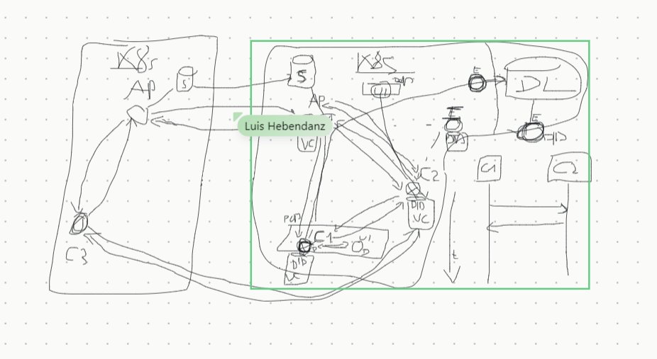

## First Meeting: 1 November 2023

**Main Components:**

- Access Points (AP)
- Client (C1, C2...)
- Ledger
- S - databases

All have identifiers and claims: DID and VC and these are stored in a digital wallet (DL-ledger)

With the help of the DID we can get a DID document for that entity
A third institution is responsible for verification of credentials in the digital domain

You only get 1 DID document or nothing if this document doesn't exists

You can also put cryptographic keys in the DID document

If 2 components have the keys for each other they can securely communicate

At some point C1, wants to register/connect to the AP1 (like connecting to the WiFi)
Not sure if you can trust this AP1? We need mutual authentication on both directions

C1 will send VC to the AP and AP will send VC to C1 - look into each-other credentials and allow connection/authentication

HTTPS is only 1 way authentication - bank server proves its security with a security certificate. The user doesn't send a certificate, the bank server doesn't know you as a user.

The DIDs are created by the entities themselves, the certificates are provided by another party.

You go to a bank, present your DID and the bank gives you a VC that proves you are a client.

You might use the same VC that was issued by the bank for a different purpose.

In the UI, the entity should see its own DID (its own instance-user interface) must also be to see its own DID document - can store it locally but also in a ledger (to get the documents from). Also see your own verified credentials.

C1 and C2 securely communicate with each other
C2 asks AP for x Service - AP cannot provide the x Service but C1 can provide it - so C2 needs to establish a secure P2P connection with C1 to get x Service.
This happens within the same network

C2 asks for a service Y but this service could not be provided in the same network (AP1) but by another network (AP2)
If the S-databases between AP1 and AP2 are connected, C2 from AP1 can establish a connection with C3 from AP2

From time to time, the entities should want to change the keys in the DID document

S - all list of services within a network that are provided

Multiple endpoints to get data from different sources:
DID
VCs
etc.

Views:

- One big GOD view that shows all the connections between all the components (C1,C2..AP, S etc.) and you can zoom in on any entity to view details (DID) and also a sequence diagram which entity is connected with which one via VCs
- No authentication needed to be implemented for viewing the UI

Next steps before next meeting:

- Decide on tech stack (done)
- DID and VC (get domain knowledge)
- Draft/sketch for the views based on the knowledge we get from the domain
- Research libraries and see how it handles the sequence diagrams
- Test and get used to the repository

