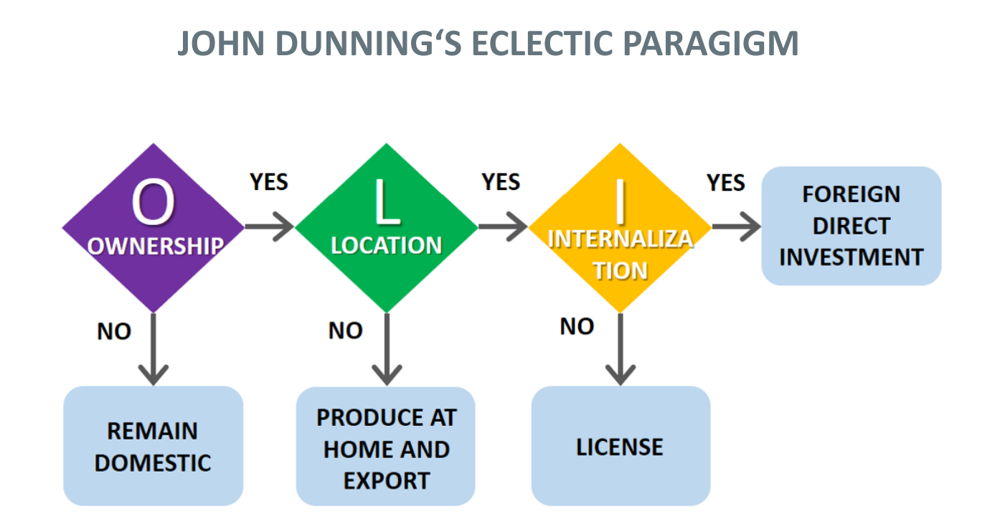

## MNC - An Academic Overview

What is globalization?

- a movement towards a more integrated world
- growing _economic dependence_ among countries, industries and enterprises

Increasing border movement of:

- goods & services
- capital
- information & knowledge
- people

> global =/= international =/= multinational =/= transnational

Globalization is not a new phenomenon: <ins>Siemens has been a global company since at least late 1800's. By 1914, Siemens was employing 82,000 people worldwide.</ins>

When asked in a survey on how globalized the world is, the actual metric is way lower than the average survey response, meaning that the world is not that 'globalized' yet, contrary to popular belief. This was part of the DHL Global Connectedness Index Study done in 2018 (2019 update).

[Link to study](https://group.dhl.com/content/dam/deutschepostdhl/en/media-center/media-relations/documents/2019/dhl-gci-2019-update-full-study.pdf)

The study mentions that the global connectedness declined in 2018 after reaching a record high in 2017. Based on the data points, it seems that the pullback was driven by shrinking international capital flows, especially FDI (foreign direct investments) and portfolio equity investments.
The reason for the drop in FDIs could be due to U.S. tax policy changes. So between trade, capital, information and people metrics that are used in the report, the decrease in capital flows was the major factor of the downturn in global connectedness in 2018.

After a modest decline in 2020, the DHL Global Connectedness Index rebounded to above pre-pandemic level in 2021.

Nowadays: The Netherlands is the world's most connected country, while Europe tops the regional ranking.

The main takeaway from this study is that globalization has not gone into reverse and the world is most globalized than it has ever been before. There is decoupling between 2 superpowers: USA and China due to the trade wars started in 2018, however this decoupling has not led to a fragmentation of international activity.

## Drivers of Globalization

- Technology: lowers cost of communication & transportation
- Political decisions: agreements, elimination of barriers
- Demography: integration of other countries (BRICS)

> BRICS is an acronym for Brazil, Russia, India, China, and South Africa

## Drivers of De-Globalization/Decoupling

- Changing interests: opting out of prior agreements
- Hegemonic decline: leading to loss of sufficient coercive power

Other factors driving decoupling:

| Dimensions |         Forces         |                                  Connection with decoupling                                   |
| :--------: | :--------------------: | :-------------------------------------------------------------------------------------------: |
|  Politics  |      Cold War II       |               Great power rivalry between China and the US for global supremacy               |
|            |      Ukraine War       |                China's alliance with Russia deepening antagonism with the US.                 |
| Economics  |     Falling Growth     |                                 Loss of market attractiveness                                 |
|            |      Labor Costs       |                          Loss of competitiveness as production site                           |
|            |       Governance       |                          Loss of attractiveness as place of business                          |
|            |      Uncertainty       |                                                                                               |
|            |   Pandemic response    | China's zero-COVID policy: repeated lockdowns and severe supply chain & staffing restrictions |
| Technology |     Digitalization     |         Ability to reintegrate operations previously outsourced to reduce complexity          |
|            |        Additive        |                     Ability to produce small, customized batches locally                      |
|            | Manufacturing Platform |       Ability to flexibly farm out manufacturing and service jobs for local production        |

The case of Volkswagen and China: the risks of relying on authoritarian states - Volkswagen biggest market is China. Should Volkswagen as an multinational corporation lose its biggest market because China is an authoritarian state and supported Russia in the Ukraine war?

The case of Delivery Hero: what is their strategy behind internationalization? Their international presence is confusing - headquartered in Berlin, Germany but doesn't operate in the German market. It entered the Berlin market in 2021, but then exited due to high costs.

The case of Philips: their internal structure is very complex:

- Operating units in 60 countries
- **Unit size:** Some units are large, fully integrated companies developing, manufacturing and marketing products. Other units are small, single-function operations responsible for R&D or manufacturing for only one or a few businesses.
- **Unit employees:** Some units have +5000 employees and might be among the largest companies in their host countries, whereas some units might employ <50 people.
- **Unit lifetime:** Some units have been operational for more that 50 years, while some other are less than 10 years old.

Questions of interest:

- Why do multinational firms exist?
- What are the boundaries of the MNC?
- Which markets are selected?
- How do MNCs enter foreign markets and how successful are their foreign activities?
- Under which circumstances do firms de-internationalize?
- How are MNC governed, and how do their value networks look like?
- What is the role of culture? Does 'cultural distance' matter?
- What impact will the digital revolution have on MNCs?
- What roles do MNCs play, what roles can they play in a (de)globalised world?
- Are these questions answered differently for companies with a different country origin? Is there a case for a 'global' theory of MNCs?

So we have 2 types of theories that can be applied in International Business:

1. Scientific Theories
2. Layman Theories: in the context of international business or economics, typically refer to informal, non-academic explanations or understandings of how multinational corporations (MNCs) or foreign direct investments (FDIs) operate. These theories are not grounded in the rigorous research and theoretical frameworks that characterize academic studies but are based on general observations, common sense, or simplified explanations of complex processes.

### Layman theories Examples

1. Profit Maximization: The simple idea that companies go international primarily to increase their profits by exploring new markets, accessing cheaper labor, or taking advantage of lower production costs. While this is true, academic theories provide more nuanced reasons involving strategic asset seeking, market imperfections, or the eclectic paradigm.

2. Market Saturation: A layman theory might suggest that companies expand internationally because their home market is saturated, and they have no room to grow. While market saturation can be a motivator, academic theories also consider strategic asset seeking, efficiency seeking, and the pursuit of innovation through global expansion.

3. Follow the Leader: The notion that companies expand into certain countries or regions simply because their competitors are doing so. This observation aligns with the concept of competitive dynamics but lacks the depth of strategic considerations explored in theories like the OLI paradigm, which examines ownership, location, and internalization advantages.

4. Cultural Similarity: The idea that companies prefer to invest in countries with similar cultures because it's easier to do business. While cultural proximity can influence FDI decisions, more comprehensive theories take into account a range of factors including economic, political, and legal environments.

5. Risk Diversification: The basic understanding that companies invest abroad to diversify their risk. This aligns with portfolio theories in finance but oversimplifies the strategic calculations involved in international investment decisions, such as assessing market potential, competitive advantage, and strategic fit.

Flaws in constructing a general theory for MNC:

- Empirical tests often lead to conflicting results due to different samples and different statistical methods
- Theoretical relationships between independent and dependent variables often underspecified
- Measurement issues
- Replication of empirical studies is often not possible
- Theories are more than aggregation of hypotheses, even if empirical testing leads to the falsification of a hypothesis, this rarely leads to the falsification of the theory
- Processes cannot be analyzed by using the same instruments that have to be used for analyzing contents
- Can social systems be analyzed quasi-scientifically?
- Are theories valid universally or conditional on culture?

Can there be a theory that encapsulates all the field of International Management?

There has been an evolution on the international business/MNC theories over many years.

### Before 1960s:

1. Mercantilism (17th century, Jean-Baptise Colbert): Economic theory that emphasizes the importance of accumulating monetary wealth, primarily through a positive balance of trade, for the state's power.

2. Analysis of trade flows between different countries

3. Portfolio theories: Analysis of cross-border capital streams that follow differences in interest rates

4. Factor proportions theory (Heckscher/Ohlin): Theory that suggests that countries export products that utilize their abundant and cheap factors of production (like labor or capital) and import products that require factors that are scarce and expensive domestically. This theory explains international trade patterns based on differences in factor endowments among countries, positing that trade allows countries to effectively leverage their distinct economic assets for mutual benefit.

5. Leontief paradox: Challenges the Factor Proportions Theory by presenting empirical evidence that the United States, which was relatively abundant in capital, exported labor-intensive goods and imported capital-intensive goods, contrary to what the theory predicted. This paradox, identified by economist Wassily Leontief in 1953, suggests complexities in international trade patterns that cannot be fully explained by differences in factor endowments alone.

6. Location theories: Explain how and why businesses choose specific geographic locations for their operations, emphasizing factors such as proximity to markets, access to raw materials, labor availability, and transportation costs.

7. MNCs as key players in the object range of imperialism theories (e.g., Hobson, Lenin, Schumpeter): Multinational corporations (MNCs) are often discussed in theories about imperialism, where they're seen as modern forces that help powerful countries maintain and extend their influence over less powerful ones. According to thinkers like Hobson and Lenin, MNCs help rich countries stay rich by investing in poorer countries to take advantage of their resources and cheap labor. On the other hand, Schumpeter was a bit critical of these views but still recognized that big companies could contribute to economic inequalities. Basically, these theories suggest that MNCs play a big part in how wealth and power are spread around the world, often benefiting the countries where they come from.

### 1960: Hymer's doctoral thesis on FDIs

Stephen Hymer's doctoral thesis, published in 1960, is a seminal work that significantly impacted the theories of Foreign Direct Investment (FDI) and Multinational Corporations (MNCs).

1. **Market Imperfections and Monopolistic Advantage**: Hymer challenged the traditional view of FDI, which was largely based on capital movements seeking higher rates of return. Instead, he proposed that FDI occurs due to market imperfections and the desire of firms to exploit their monopolistic advantages (such as superior technology, brand names, and managerial expertise) in foreign markets. This allows them to overcome the disadvantages of operating abroad.

2. **Direct Investment over Portfolio Investment**: Hymer distinguished between direct investment (where control of the foreign operation is sought) and portfolio investment (purely financial investment without control). He argued that firms engage in FDI not just for higher returns but to exert control and protect their monopolistic advantages.

3. **Internalization Theory Foundation**: His work laid the groundwork for the internalization theory, suggesting that firms go multinational to internalize or control cross-border transactions within their own hierarchies, thereby reducing transaction costs and avoiding market imperfections.

4. **Impact on MNC Theories**: Hymer's thesis shifted the focus of MNC theories towards understanding the strategic behaviors of firms in seeking control and minimizing competitive pressures. It highlighted the role of power and control in international business operations.

5. **Structural Market Imperfections**: He identified structural market imperfections, such as differences in access to information and technology, as key drivers for firms to pursue FDI. This challenged the then-prevailing economic theories that assumed perfect market conditions.

6. **Integration of Industrial Organization and International Business**: Hymer's work integrated concepts from industrial organization (such as market structure, firm strategy, and market behavior) with international business studies, offering a comprehensive framework to analyze MNCs' strategic decisions.

7. **Influence on Subsequent Theories**: His thesis influenced subsequent theories in international business, including the eclectic paradigm (OLI framework) by John Dunning and the theory of the multinational enterprise as a network.

Hymer's contribution through his doctoral thesis fundamentally altered how scholars and economists view FDI and MNCs, moving the discourse beyond simple economic explanations to incorporate strategic, organizational, and market structure considerations.

### 1960 until 1970

1. Analysis of FDI patterns (e.g. Linder's theory of demand structure): Proposes that countries with similar demand structures are more likely to trade with each other. In the context of FDI, this theory suggests that firms are likely to invest in countries where consumer preferences are similar to their home market, as these markets would demand similar products, making it easier for firms to predict and meet local demand.

2. Product Life-Cycle Theory (Vernon): Argues that a product goes through distinct stages: introduction, growth, maturity, and decline. Initially, new products are developed and produced in the home country. As the product matures and becomes standardized, production moves to lower-cost foreign locations to capitalize on economies of scale and access new markets, influencing FDI patterns as firms seek to optimize production and distribution.

3. Focus on Functions, Especially Marketing, but Also Increasingly Finance and Human Resource Management: This perspective emphasizes the critical role of functional strategies—marketing, finance, and human resources—in the success of MNCs. Effective marketing strategies are essential for understanding and entering new markets, finance strategies for managing global capital and investments, and human resource strategies for attracting, developing, and retaining talent across diverse cultural and regulatory landscapes.

4. Detailed Analysis of FDI Decision Processes (Aharoni): Provides a comprehensive framework for understanding how firms decide to invest abroad. It highlights the importance of behavioral factors, including the role of initial stimuli (e.g., unsolicited orders, competitors' actions), the gathering of information, and the influence of risk perceptions and biases. Aharoni suggests that FDI decisions are not always rational or linear but are influenced by a complex interplay of internal and external factors, including managerial attitudes and external pressures.

### 1970 until 1980

1. Industrial Economics & Follow-the-Leader Hypothesis: Focuses on the strategic behaviors of firms, market structures, and their interactions. It examines how these factors influence a firm's performance, market power, and competitive advantage in an international context. The Follow-the-Leader Hypothesis suggests that firms often enter foreign markets or industries following the lead of successful first movers, capitalizing on established paths and reducing the uncertainties associated with entering new markets.

2. Finance theory: Addresses how companies manage their financial resources to maximize shareholder value across different countries, considering factors like exchange rate risk, international diversification, and global financing options. It includes the study of optimal capital structure, investment decisions, and risk management strategies in an international setting.

3. Strategy-Structure School (Stopford & Wells): Analyzes the relationship between corporate strategy and organizational structure in MNCs. Their work suggests that as companies internationalize, their structures evolve from simple international divisions to more complex global matrices, reflecting changes in strategy, market focus, and the need for coordination across diverse operations.

4. Further Development of Process-Oriented Approaches (e.g., Uppsala School): Represents a process-oriented approach to internationalization, emphasizing the gradual, step-by-step process through which firms increase their international involvement. This model highlights the role of experiential learning, incremental market entry, and the importance of managing uncertainty in international expansion.

5. “Obsolescing Bargain“ Model; Analysis of Firm/State Interactions (Vernon): Deals with the changing nature of agreements and negotiations between MNCs and host country governments. Initially, the host government may offer favorable terms to attract FDI, but as the foreign investment becomes established and less mobile, the bargaining power shifts towards the government, which may then seek to renegotiate terms or impose stricter regulations. This model highlights the dynamic and often contentious relationship between MNCs and host states over time.

### 1980 until 1990

1. Transaction Cost and Internalization Theory; Integration Efforts (Eclectic Paradigm; Dunning): Suggests that firms will internalize (bring within the firm) those transactions that are costly to conduct on the open market due to factors like search and information costs, bargaining costs, and enforcement costs. This theory forms part of the foundation for Dunning's Eclectic Paradigm, which integrates internalization advantages with ownership and location advantages to explain why firms choose to engage in foreign direct investment (FDI) and how they decide to enter foreign markets.

2. Description of MNCs as Extensive Networks; Strategic and Structural Difficulties: This perspective views MNCs as extensive networks of units spread across different countries, emphasizing the complexity of managing these entities. The strategic and structural difficulties include coordinating across diverse environments, optimizing global operations while remaining flexible to local needs, and leveraging global knowledge and resources effectively.

3. Particular Interest in JVs, Alliances, and Coalitions: Joint ventures (JVs), alliances, and coalitions are strategic partnerships that allow firms to share risks, access new markets, combine resources, and leverage complementary strengths. These collaborative arrangements are particularly important for MNCs navigating complex international landscapes, enabling them to achieve objectives that might be difficult or costly to achieve alone.

4. Cultural Problems (e.g., Hofstede): Geert Hofstede's cultural dimensions theory provides insights into how national cultures influence organizational behavior and management practices. Cultural problems in MNCs can arise from differences in power distance, individualism vs. collectivism, masculinity vs. femininity, uncertainty avoidance, long-term orientation, and indulgence vs. restraint. Understanding these cultural dimensions is crucial for MNCs to manage cross-cultural teams and operations effectively.

5. What do the Japanese do better?: Japanese MNCs are often praised for their approaches to management, including lean manufacturing, continuous improvement (Kaizen), consensus decision-making, and a strong focus on quality and long-term employee development. These practices have contributed to the global competitiveness of Japanese firms in various industries.

6. Strategic Trade Theory (P. Krugman): Paul Krugman's Strategic Trade Theory suggests that governments can play a role in increasing national welfare through strategic trade policies, such as subsidies for key industries, to help domestic firms achieve a competitive advantage in the global market. This theory challenges the classical free trade assumption that market outcomes are always optimal and suggests that strategic government intervention can benefit the home country.

7. “Varieties of Capitalism”: The “Varieties of Capitalism” framework categorizes economies based on how companies coordinate with each other, workers, and institutions. It contrasts liberal market economies (LMEs), where firms coordinate their activities primarily via hierarchies and competitive market arrangements, with coordinated market economies (CMEs), where firms depend more on non-market relationships. This framework helps to understand how institutional differences across countries influence corporate strategies, including those of MNCs.

### 1990 until 2000

1. “The transnational solution” & process school (Bartlett & Ghoshal): Argues for a new organizational form for MNCs that transcends traditional models (multinational, global, and international) to achieve global efficiency, local responsiveness, and worldwide learning simultaneously.
2. Internationalization of small enterprises: Refers to the process by which small and medium-sized enterprises (SMEs) expand their operations beyond their home markets. This process challenges traditional theories that mainly focused on large corporations, highlighting the role of entrepreneurial vision, niche market strategies, and the use of digital technologies in enabling smaller firms to compete internationally.
3. International Entrepreneurship & “Born Globals”: Focuses on the intersection of entrepreneurial behavior and international business, emphasizing the role of innovative, risk-taking entrepreneurs in driving the international expansion of firms. “Born Globals” are firms that internationalize rapidly from their inception, leveraging global networks, advanced technologies, and an entrepreneurial orientation to compete in international markets without the gradual step-by-step approach traditionally associated with internationalization.
4. Macro- and microgeographic approaches (e.g., Porter’s diamond model): Provides a framework for understanding the competitive advantage of nations, focusing on four key determinants: factor conditions, demand conditions, related and supporting industries, and firm strategy, structure, and rivalry. This model illustrates how certain countries become competitive in specific industries and how firms can leverage national performance factors to succeed in the global marketplace. It offers both macro (national level) and micro (firm level) geographic perspectives on international business.
5. Enlargement of research methodologies (e.g. longterm studies, event studies, behavioral studies)

### 2000 until now

1. Corporate Social Responsibility/SDGs: CSR refers to a company's commitment to manage the social, environmental, and economic effects of its operations responsibly and in line with public expectations. The Sustainable Development Goals (SDGs) are a collection of 17 global goals set by the United Nations, aimed at ending poverty, protecting the planet, and ensuring prosperity for all. MNCs integrate CSR and SDGs into their business strategies to address global challenges while maintaining profitability.
2. Management and transfer of knowledge within MNCs: This concept focuses on how MNCs create, retain, and share knowledge across their global operations. Effective knowledge management and transfer are critical for leveraging the firm’s collective expertise, fostering innovation, and achieving competitive advantage in diverse markets. Strategies include best practice transfers, training programs, and technology-enabled collaboration platforms.
3. Cross-border M&A: Cross-border mergers and acquisitions (M&A) involve companies from different countries merging or one company acquiring another. This strategy allows MNCs to quickly enter new markets, access valuable resources, and achieve synergies. However, it also presents challenges such as cultural integration, regulatory compliance, and aligning corporate strategies.
4. Parent-subsidiary relationships: This area examines the dynamics between the headquarters (parent) of an MNC and its foreign subsidiaries. Effective management of these relationships involves balancing global integration and local responsiveness, ensuring strategic alignment, and navigating power and control issues to leverage the subsidiary’s local knowledge and capabilities.
5. Resource- and capability based approaches: These approaches focus on the internal resources and capabilities of firms as the primary source of competitive advantage. In the context of MNCs, leveraging unique resources (tangible and intangible assets) and capabilities (processes and knowledge) across global operations is crucial for sustainable international success.
6. MNCs from emerging economies (e.g., China): The rise of MNCs from emerging economies challenges traditional theories that primarily focused on firms from developed countries. These MNCs leverage their unique strengths, such as cost advantages, adaptability, and understanding of other emerging markets, to compete globally.
7. Digitalization: For MNCs, digitalization enables innovations in products and services, streamlines operations, enhances customer engagement, and facilitates data-driven decision-making.
8. De-Globalization: Refers to a trend towards more protectionist national policies, reduced international trade and investment, and a shift away from economic globalization. MNCs must navigate these challenges by adapting their strategies, such as reevaluating supply chains and focusing on regional markets.
9. “The global factory”/GVCs: “The Global Factory” concept and Global Value Chains (GVCs) describe how production processes are dispersed worldwide, with different stages of the production process located in different countries. MNCs manage and coordinate these complex networks to optimize efficiency, reduce costs, and serve global markets effectively.
10. International diversification of family firms: Family firms pursuing international diversification seek to expand their operations across borders. This strategy can offer growth opportunities and risk mitigation through geographic diversification. However, it also requires balancing the unique values, governance structures, and long-term orientations of family businesses with the demands of competing in global markets.

### Major journals (founding years):

1. Management International Review (1960)
2. Journal of World Business (1965)
3. Journal of International Business Studies (1970)
4. International Business Review (1992)
5. Multinational Business Review (1992)
6. Journal of International Management (1994)
7. Global Strategy Journal (2010)

### John Dunning's Eclectic Paradigm

[Link](https://ebrary.net/21274/management/dunnings_paradigm)

John Dunning's Eclectic Paradigm, also known as the OLI framework, is a comprehensive theory designed to explain why companies become multinational enterprises (MNEs) and how they choose to enter foreign markets. Here are some key notes about the Eclectic Paradigm:

1. **Three Core Components**: The Eclectic Paradigm consists of three main factors—Ownership advantages (O), Location advantages (L), and Internalization advantages (I)—that together explain a firm's motives and ability to engage in foreign direct investment (FDI).

2. **Ownership Advantages (O)**: These are specific assets or capabilities controlled by a firm that give it a competitive edge over other firms. These can include technology, patents, brand names, managerial expertise, and other proprietary knowledge. Ownership advantages enable a firm to overcome the costs of operating in a foreign market.

3. **Location Advantages (L)**: These refer to the characteristics of a host country that make it an attractive destination for FDI. Factors can include natural resources, labor costs, market size, political stability, and the regulatory environment. Location advantages influence the choice of where to invest.

4. **Internalization Advantages (I)**: These advantages arise from a firm's decision to manage its resources and capabilities within the firm (i.e., internally) rather than through licensing, franchising, or other forms of partnership with foreign firms. Internalization can help a firm protect its proprietary knowledge, reduce transaction costs, and mitigate risks associated with market imperfections.

5. **Framework Application**: The Eclectic Paradigm is used to analyze the strategic decisions of MNEs regarding where, how, and why they choose to internationalize. It suggests that for a firm to engage in FDI, it must possess O advantages to compete with local firms, find L advantages in the host country to make investment worthwhile, and see I advantages in controlling the foreign business activity rather than using alternative modes of entry.

6. **Flexibility and Broad Applicability**: Dunning's framework is praised for its flexibility and applicability to various types of FDI and international business strategies. It accommodates changes over time in the global economic environment and the evolution of multinational enterprises.

7. **Impact on International Business Research**: The Eclectic Paradigm has significantly influenced research and theory in international business by providing a robust model to understand the complexities of FDI and MNE behavior. It has spurred empirical research and policy analysis in the field of global business.

Here are some examples of when to use this paradigm:

1. Deciding on Overseas Expansion

- Situation: A company considering whether to expand its operations into a new country.
- Application: The OLI framework can help the company assess its own ownership advantages (like proprietary technology or brand strength), the location advantages of potential host countries (such as market size or labor costs), and the benefits of internalizing its operations abroad versus licensing or partnering with local firms.

2. Evaluating Foreign Market Entry Strategies

- Situation: A firm deciding between different modes of entry into a foreign market, such as exporting, franchising, or establishing a subsidiary.
- Application: Using the OLI framework, the firm can evaluate if its ownership advantages are better exploited through direct investment (establishing a subsidiary) or if the location advantages of the host country favor a lighter footprint initially, like exporting.

3. Analyzing International Competitiveness

- Situation: A multinational enterprise (MNE) assessing its competitive position in various international markets.
- Application: The paradigm can guide an MNE to analyze its unique ownership advantages that contribute to its competitiveness, understand the specific location advantages of the markets it operates in, and assess whether its internalization strategies are effectively maximizing profits and minimizing risks.

4. Assessing Impact of Policy Changes on FDI

- Situation: Evaluating how changes in trade policies or regulations in a host country might affect existing or potential FDI.
- Application: The framework can be used to analyze how alterations in the regulatory environment (a location advantage/disadvantage) could impact the attractiveness of FDI in that country and influence MNE strategies regarding internalization versus external partnerships.

5. Mergers and Acquisitions Analysis

- Situation: A company contemplating acquiring a foreign company or merging with it.
- Application: The OLI framework helps in assessing the ownership advantages that the merger or acquisition would bring, such as access to new technologies or markets, alongside evaluating the location advantages of combining operations and the efficiency gains from internalizing activities.

6. Strategic Alliances and Joint Ventures

- Situation: Considering forming a strategic alliance or joint venture with a foreign company.
- Application: The company can use the OLI paradigm to understand how such a partnership could leverage the ownership advantages of both firms, exploit the location advantages of engaging in a specific market, and whether internalizing such an arrangement offers significant benefits over operating independently.

### Book Explanation

Because the existing approaches (e.g. the internalisation theory or the theory of monopolistic advantages) alone cannot fully explain the choice of foreign operation mode, John Dunning developed a comprehensive approach, the so-called Eclectic Paradigm, which aims to offer a general framework to determine which operation mode is the most appropriate.

It specifies a set of three conditions that must prevail simultaneously to stimulate FDI from a company (Rugman/Collinson 2012, pp. 67-70; Dunning/Lundan 2008, pp. 96-108):

1. Ownership-specific advantages (O): The firm must possess some unique competitive advantages (firm-specific advantages, FSA) that outweigh the disadvantages of competing with local firms in their home market (liability of foreignness). Often, ownership-specific advantages take the form of the possession of intangible assets, which (at least temporarily) are specific to the firm. This follows the general argument by Hymer.

2. Location-specific advantages (L): If foreign direct investment is to take place, it must be more profitable for the company to undertake the activity in the foreign country than in the home country. Otherwise foreign markets would be served by other operation modes. Location-specific advantages (or country-specific advantages, CSAs) can include, for example, labour costs, an efficient and skilled labour force, tariffs, transport costs or natural resources.

3. Internalisation advantages (I): Companies that possess specific advantages can either exploit them themselves (internalise them) or sell the advantage to other companies. The internalisation choice can be explained by internalisation theory, as pointed out above.

Whether foreign direct investment is favourable depends on which types of advantage prevail. To undertake internationalisation via wholly-owned subsidiary, all three types of benefits, O, L and I, must be present. This case is illustrated in Figure 6.2, along with other situations that lead to different decisions about operation modes.

### What is a Foreign Direct Investment (FDI)?

Foreign Direct Investment (FDI) is when a company or individual from one country invests money in another country by either setting up a business operation, like a factory or a store, or buying a controlling interest in a foreign company.

1. Ownership: FDI means owning or controlling a stake in a business in another country. It's not just lending money or buying stocks; it's about having a significant say in how the business is run.

2. Long-term Relationship: FDI is about establishing a lasting interest in a foreign economy. Investors are not just looking for quick profits; they're aiming to contribute to and benefit from the growth of the business over time.

3. Two Main Types:

- Greenfield Investment: This is when a company starts a new venture in a foreign country from scratch, like building new factories or stores.

- Acquisitions or Mergers: This is when a company buys a controlling share in an existing company in another country.

4. Why Companies Do It:

- Access New Markets: Companies invest abroad to sell their products or services in new countries.
- Cost Reduction: Setting up production in countries where labor or materials are cheaper can reduce costs.
- Resource Access: Companies might invest in countries rich in natural resources or specific talents they need.
- Strategic Assets: Sometimes, FDI is made to acquire strategic assets like technology, brand names, or expertise.

5. Impact on Host Country:

- Economic Growth: FDI can bring in capital, create jobs, and foster economic development.
- Technology Transfer: It can also lead to the transfer of new technologies and skills to the host country.

6. Impact on Home Country:

- Outflow of Capital: Money used for FDI is an outflow from the home country but can lead to returns in the form of profits.
- Global Presence: Helps companies from the home country expand their global footprint and competitiveness.

More on Mercantilisim:

- **State-Centric Approach**: Views the state as the central figure in economic activity, where economic actions are geared towards increasing national wealth and power.
- **Export Promotion**: Encourage exports over imports to maintain trade surplus. For MNCs, incentives to expand abroad.
- **Protectionism**: Supports the use of tariffs and quotas to protect domestic industries. For MNCs, meaning benefitting or facing these policies depending on the country of origin and where they operated in.
- **Colonialism Ties**: Establishment of colonies to secure raw materials. For MNCs, they exploited colonial resources and markets.

More on the analysis of trade flows between different countries

- **Balance of trade**: Evaluates the difference between exports and imports in a country.
- **Comparative Advantage**: Countries should specialize in producing goods and services they can produce more efficiently than others. MNCs locate different parts of their production processes in countries where they have a comparative advantage.
- **Global Supply Chains**: MNCs are integral to the creation and operation of global supply chains, where production is fragmented across countries.
- **Foreign Direct Investment (FDI)**: MNCs contribute to the trade flows not just through exports and imports but also through investments in foreign countries.
- **Trade policies and agreements**: How trade policies, agreements between countries affect MNC operations and strategies.
- **Economic intergration**: The degree of economic ntegration influences trade flows by reducing or eliminating trade barriers among countries and therefore affecting how MNCs operate within these regions.

More on the portfolio theories: Analysis of cross-border capital streams that follow differences in interest rates

- **Interest Rate Differentials**: Countries have different interest rates due to varying economic policies, growth rates, and inflation levels. Investors seek to benefit from these differences by investing in countries with higher interest rates, expecting higher returns.

- **Capital Mobility**: Investors move their capital across borders to invest in financial assets (like stocks, bonds, and currencies) that offer better returns. This movement is influenced by the global financial environment and the relative stability and potential of different markets.

- **Risk and Return**: Portfolio theories emphasize the trade-off between risk and return. Investing in foreign assets can offer higher returns due to higher interest rates but also comes with higher risks, including currency risk, political risk, and economic instability.

- **Diversification**: One of the key strategies in portfolio management is diversification—spreading investments across various countries and asset classes to reduce risk. By investing in countries with different economic cycles, investors can mitigate the impact of a downturn in any single market.

- **Currency Exchange Rates**: Changes in currency values can significantly affect the returns on foreign investments. A stronger currency in the investment country can increase returns when converted back to the investor's home currency, and vice versa.

- **Capital Flow Dynamics**: The theories also examine how and why capital flows into certain markets at specific times. Factors include not just interest rates, but also economic growth prospects, market openness, and regulatory environments.

- **Carry Trade**: A popular investment strategy that involves borrowing in a currency with a low interest rate and investing in a currency with a higher interest rate. This strategy exemplifies how differences in interest rates can drive cross-border capital flows.
