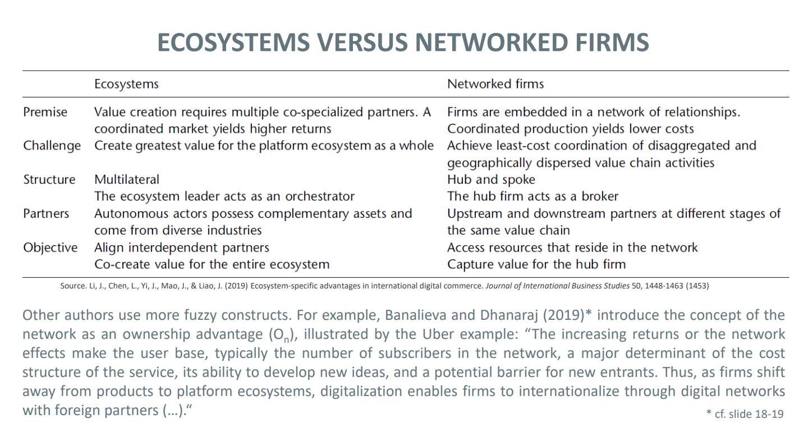
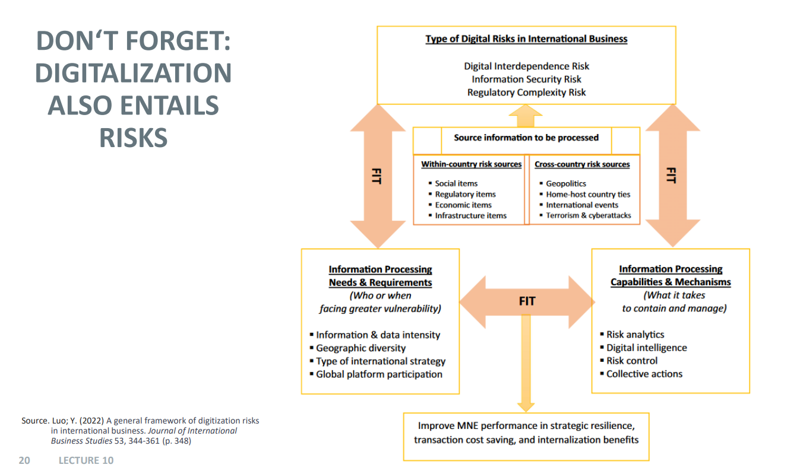

## The Multinational Corporation in the Digital Age

### Technologies in the Internet Age

1. Basic: Internet, E-Mail, Data-Transfer services
2. Key: IoT, Big Data, AI, Cyber Security
3. Other: Monitoring, VR & AR, Robotics, 3D Printing, Blockchain

#### Main source of revenue for Internet-based companies:

1. Sale of advertising space
2. Transaction-based commission fees
3. Sale of software & IT services
4. Direct sale or sale of content rights

### Why Digitialization can lighten foreign-asset footprints of MNCs?

1. Online Marketplaces

Traditional MNCs reach foreign consumers in downstream parts of the value chain through market-seeking FDI (e.g. retail distribution chains or sales and marketing operations) or through building overseas production operations that sell through local distributors.

Digital MNCs can dispense with much of that effort. They reach consumers online and often distribute through third-party channels. In smaller markets, they often maintain only local corporate offices, for minimal representation purposes.

2. Digital Value Chains

Digitalization affects not only downstream functions but often the process of production. Digitalization of production and operations is occurring in many forms:

- fully digital products and services (e.g.internet platforms)
- digitalized physical products (e.g. digital content)
- digitalization of selected parts of the production process

Empirical evidence shows that Tech MNEs are relatively "asset-poor" and the case is even more evident for digital MNCs.

### Platforms & Ecosystems

Platforms: constitute a shared set of technologies, components, services, architecture, and relationships that serve as a common foundation for diverse sets of actors to converge and create value.

Platform-based ecosystems: denote these sets of actors who are aligned to pursue a focal value proposition and who exhibit varying types of mutual dependencies borne out of their co-specialization and complementarities in the platform context, implying, in turn, different roles for actors to play in the ecosystem (for example, orchestrator, integrator, complementor).

### Ecosystems vs. Network Firms

### Types of Ecosystems

- Platform as a venue for innovation

Platform comprises of a shared set of technologies, components, tools and services, often arranged in modular architechture, that forms the foundation for the development of complementary (often co-created) products and services and their value proposition for users/customers. Platform leader is responsible for the ecosystem‘s governance (but can also share the responsibility with other ecosystem members) and offers one or more value appropriation (capture) mechanisms for ecosystem members.

Examples: Apple (iOS), Google (Android), Ford (Synx), GE (Predix), John Deere (JDLink), Microsoft (Xbox), Sony (Playstation)

**Concepts:**

Platform architecture:

- Modularity
- Openness of the design interface
- Core and peripheral components

Orchestration of the ecosystem:

- Distribution of decision rights
- Architecture of participation
- Shared world-view and shared collective identity
- Innovation leverage
- Sharing of IP and IP rights management
- Distribition of (financial) rewards/value to complementors

Roles & Strategies:

- Platform leader and complementor
- Platform leader strategies (e.g. technology leadership, innovation coherence)
- Complementor strategy (e.g., multihoming)

---

- Platform as a multi-sided marketplace

Platform comprises of technology architectures and rules that allow for regulated participation―interactions and/or transactions―of different user groups in a multi-sided market. Platform leader creates/organizes the network comprising of all participants, designs/ implements tools for participation to interact and/or exchange value, and use data to make the best match among the different “sides” for each interaction. Ecosystem consists of the platform leader, the user groups (“sides”), and other service partners who create and deliver value. Platform highly susceptible to network effects (“same-side” and “cross-side”).

Examples: Uber, Airbnb, Ebay, Alibaba, Amazon, Youtube, Twitter, Facebook, Kickstarter, Linkedin

**Concepts:**

Regulated participation of mutiple sides (user groups):

- Interaction/transaction rules
- Matching of sides

Economics of multi-sided markets:

- Same-side (direct) and cross-side (indirect) network effects
- Pricing strategies & Revenue sharing

Platform envelopment

### How Digitalization Affects MNCs

FSA = firm-specific advantages

1. Digitalization enables the modularity of a firm's FSA into technology and human capital components.

2. Digitalization increases the cross-border transferability of a firm‘s technology FSAs by enhancing its modularity and the firm's ability to bundle it with a local firm's FSA.

3. Digitalization increases cross-border appropriability hazards for a firm's technology FSAs, but also enhances the firm‘s ability to contain imitation by “walling-in“ through integrating complex technology, proprietary components, encryption, and network effects.

4. Digitalization increases a firm‘s ability to bundle its advanced and generic human capital FSAs with those in host markets through the digital platform. While digitalization increases the firm specifity of advanced human capital skills, it reduces the firm specifity of generic human capital skills.

5. Digitalization enhances a firm‘s ability to exploit its core (peripheral) technology FSAs in foreign markets with a more (less) centrally controlled digital network.

6. Digitalization enhances a firm‘s ability to exploit advanced (generic) human capital FSAs in foreign markets at lower costs by internalizing (externalizing) them. Concept of “Aqui-hiring”.

### Why US Platforms Giants Failed in China?

1. Failure to mobilize the external resources necessary to generate network effects on the demand side. FSAs alone did not materialize.

2. Failure to learn from local partners. “There is so much valuable local indigenous knowledge and so much talent out there. However, the only talent they could recognize was someone who could speak good English. That was not right. We needed to broaden or scope to understand the value of our local network.“ (Amazon informant)

3. Too much control by the corporate headquarters; failure to allow continous experimentation and customer engagement that makes up subsidiary entrepreneurship.

### Risks of Digitalization

