## FDI and MNC: Construct definitions and basic empirical data

### How to define MNCs?

1. “all enterprises which control assets – factories, mines, sales offices and the like – in two or more countries” (UNCTC)
2. “enterprises that own and control productive activities (broadly defined to cover any activity that adds value, such as manufacturing, extraction, provision of services, marketing, R&D and so forth) in more than one country” (Casson & Pearce)
3. Firms that are “not international in ownership but rather national firms operating in a number of countries through separately incorporated enterprises connected with and responsible to a central headquarter.” They are “administratively organized on such a scale as to displace the ‘market’ over wide and varied types of activity”, and may appear as “’global’ corporations forming and implementing competitive strategies on a ‘global’ scale” (Penrose)
4. “an enterprise that engages in foreign direct investment (FDI) and owns or controls value-adding activities in more than one country” (Dunning & Lundan)

Based on these definitions we see that Ownership and Control are central elements - what about the responsibility in the global supply/value chain?

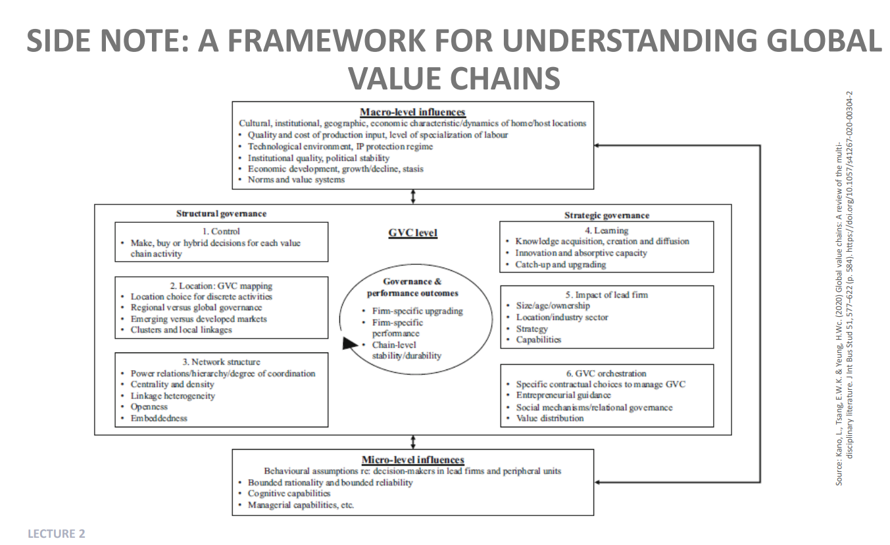

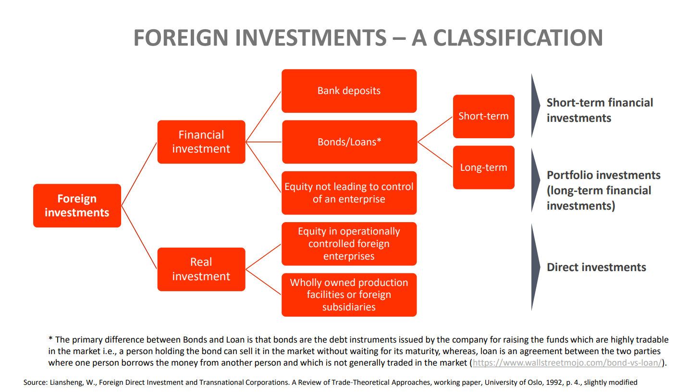

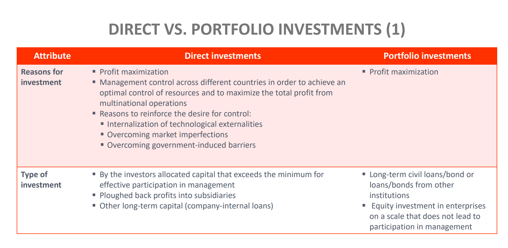

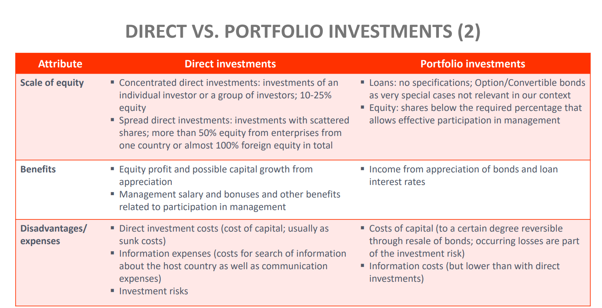

### Overview

#### Direct Investments

1. **Control and Management**: Direct investments involve acquiring a significant stake (typically more than 10%) in a foreign business, allowing the investor to have a degree of control and influence over the company’s operations and decision-making processes.
2. **Long-term Commitment**: These investments are often long-term, reflecting a strategic commitment to entering or expanding in a foreign market. They can include setting up new operations (greenfield investments) or acquiring existing foreign businesses (brownfield investments).
3. **Higher Risk and Higher Potential Returns**: Direct investments carry higher risks, given the substantial capital outlay and exposure to country and operational risks. However, they also offer higher potential returns through control over profits and strategic growth of the investment.
4. **Objective**: The primary objective is to expand the MNC's global footprint, access new markets, acquire strategic assets, or benefit from cost efficiencies by leveraging local advantages.

#### Portfolio Investments

1. **Limited Control**: Portfolio investments involve purchasing stocks, bonds, or other financial instruments in foreign companies without seeking control of these companies. Typically, a portfolio investment represents less than a 10% ownership stake in any single entity.
2. **Short-term and Liquid**: These investments are generally more liquid and can be short-term, allowing investors to diversify their investment portfolio and spread risk across different markets and sectors.
3. **Lower Risk and Returns**: Compared to direct investments, portfolio investments usually carry lower risks (as they are more diversified) and offer returns primarily through dividends, interest, and capital gains, rather than through direct involvement in business operations.
4. **Objective**: The main goal is financial gain through diversification and capital appreciation, without the intention to influence the management or operations of the foreign entities.

### Direct Investments Example: Toyota's Investment in the United States

- Description: Toyota, the Japanese automotive manufacturer, has made significant direct investments in the United States over several decades. These investments include building manufacturing plants, research and development centers, and sales operations across various states.

- Objective: Toyota's direct investments aim to localize production, reduce transportation costs, avoid import tariffs, and tailor products to the local market's preferences. This strategy also enables Toyota to have a significant influence over its operations and closely manage quality and production processes.

- Outcome: Toyota has become a major player in the U.S. automotive market, creating thousands of jobs and establishing a strong brand presence. Its direct investment strategy has allowed for greater control over its supply chain and responsiveness to U.S. market demands.

### Portfolio Investments Example: Norway's Government Pension Fund Global (GPFG)

- Description: While not a corporation, the GPFG is an example of a large-scale portfolio investor, often investing in shares of multinational corporations worldwide. It is managed by the Norwegian central bank on behalf of the Norwegian government and is funded by the country's oil revenues.

- Objective: The fund's primary objective is to ensure responsible and long-term management of revenue from Norway's natural resources. It invests in a diversified portfolio of international equities, fixed-income securities, and real estate, aiming to achieve high financial returns.

- Outcome: The GPFG holds portfolio investments in more than 9,000 companies globally, spreading its risks and generating returns through dividends, interest payments, and capital appreciation. It is a significant shareholder in many MNCs but does not seek control over these companies, exemplifying a classic portfolio investment approach.

### Analyzing Trends and Data

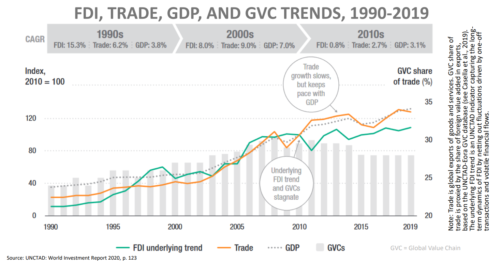

1. FDI Underlying Trend: The line graph indicates that the underlying trend for FDI increased significantly in the 1990s and 2000s but has shown stagnation or a slight decline in the 2010s.

2. Trade: Trade has seen a consistent rise, though the growth rate has slowed down in the 2010s. Despite the slowdown, trade growth keeps pace with GDP growth.

3. GDP: GDP has a dotted line indicating steady growth over the years, with notable acceleration in the 2000s followed by a more moderate increase in the 2010s.

4. GVCs: The percentage of GVCs in trade has been rising, suggesting an increase in the interconnectivity and interdependence of production across different countries.

5. Decadal Comparison: There are growth percentages listed for each decade for FDI, Trade, and GDP. The 2000s saw robust growth across all three, but there was a significant slowdown in the 2010s.

6. Index Base Year: The index is based on the year 2010, which is set as 100 to normalize the data for comparison over the years.

7. CAGR (Compound Annual Growth Rate): This indicates the average annual growth rate over a certain period. The CAGR shows a decline for FDI and Trade in the 2010s compared to the previous decades.

**Conclusion:** From this slide, one can infer that while the global economy has grown and become more interconnected over the past three decades, there have been shifts in the growth rates of FDI, trade, and the expansion of GVCs, with a notable slowing down in the last decade shown.

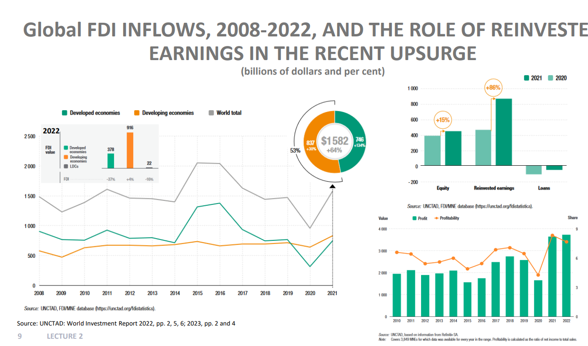

1. FDI Inflows Over Time: The line graph shows the trend of FDI inflows globally, with separate lines for developed economies, developing economies, and least developed countries (LDCs). There appears to be a significant dip around 2020, likely due to the global economic impact of the COVID-19 pandemic, followed by a recovery in 2021.

2. Developed vs. Developing Economies: The bar graph for 2022 indicates that developing economies received more FDI than developed ones. The FDI value for developed economies shows a decrease (indicated by -37%), whereas developing economies show an increase (+4%), and LDCs show a significant increase (+16%).

3. Composition of FDI: The doughnut chart breaks down the total FDI value of $1,582 billion into three components: equity, reinvested earnings, and loans. Reinvested earnings represent the largest share (+64%), suggesting that a significant portion of FDI is coming from profits that multinational companies choose to reinvest in their foreign operations.

4. Reinvested Earnings Surge: The bar graph on the right shows a dramatic increase in reinvested earnings from 2020 to 2021 (+86%), indicating that companies have been substantially reinvesting their profits rather than repatriating them or distributing them as dividends.

5. Equity and Loans: The other components of FDI, equity and loans, have also experienced changes. Equity saw a rise (+15%) from 2020 to 2021, while loans show a less clear trend with the provided data.

6. Profitability: The bottom right graph shows profitability and profit values over time. There is a notable increase in profitability in 2021, which correlates with the upsurge in reinvested earnings, suggesting that companies were more profitable and chose to reinvest those profits into their foreign affiliates.

7. Source and Notes: The slide references the UNCTAD World Investment Report 2022 and provides a note that covers 3,849 MNEs for which data was available every year in the range. Profitability is calculated as the ratio of net income to total sales.

**Conclusion:** From this slide, one can conclude that despite fluctuations, there is a recent trend towards recovery in global FDI, with developing economies and LDCs gaining a larger share of FDI inflows and reinvested earnings playing a significant role in FDI composition, particularly in the wake of the pandemic's economic impact.

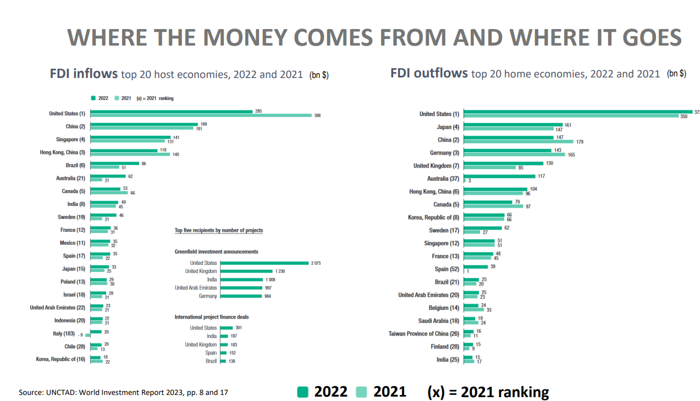

1. FDI Inflows: The left side of the slide lists the top host economies for FDI inflows in 2022 and 2021, with countries ranked and the FDI amounts represented in billions of dollars. The list shows that the United States, China, and Singapore are among the top recipients of FDI.

2. FDI Outflows: The right side of the slide shows the top home economies for FDI outflows for the same years. The United States, Japan, and China are the top countries from which FDI originates.

3. Greenfield Investments and Project Finance: The slide also includes additional information on greenfield investment announcements and international project finance deals, with the United States, the United Kingdom, and India being top recipients of greenfield investments, and the United States, the United Kingdom, and India again being significant in terms of project finance deals.

The United States and China appear as both sources and destinations for foreign direct investment (FDI) inflows and outflows due to their roles as major players in the global economy. Here's why:

**As FDI Inflow Destinations:**

United States and China: Both countries have large, sophisticated, and diverse economies with numerous opportunities for investment. They attract FDI due to their sizable consumer markets, advanced technological infrastructure, and strong industrial sectors.

**As Sources of FDI Outflows:**

- United States: American companies invest abroad to access new markets, acquire strategic assets like natural resources or innovative technologies, and to optimize their supply chains through cost-effective production sites.

- China: Chinese firms, supported by the government's "Going Out" policy, invest overseas to secure raw materials, gain technological competencies, and enhance their global market presence.

### By Countries

1. Developed Countries (EU, North America, Others):

- FDI Inflows: There is a visible decline in FDI inflows to developed countries when comparing the two periods (2007-2009 vs. 2018-2020).
- FDI Outflows: Similar to inflows, FDI outflows from developed countries also experienced fluctuations, with an overall downward trend in the 2018-2020 period compared to 2007-2009.

The data suggests that developed countries have experienced a reduction in their dominance of global FDI flows in recent years. This could be due to a variety of economic factors, including but not limited to, changes in global investment patterns, increased competition from emerging economies, and possibly political and economic uncertainties that might have influenced investment decisions.

2. Asia (East Asia, South-East Asia, South Asia, West Asia):

- FDI Inflows: There seems to be an overall increase in FDI inflows to Asian regions over time, with figures provided for East Asia, South-East Asia, and South Asia.
- FDI Outflows: Similar to inflows, there may be an increase in FDI outflows from regions within Asia, suggesting that Asian economies are becoming more prominent as sources of global investment. Some sub-regions, such as East Asia, might be contributing more to outflows compared to others like West Asia or South Asia.

The data likely shows the growing importance of Asia in the global economy, both as a destination for FDI and as a source of outward investment. This trend could be driven by various factors, including economic growth in the region, liberalization of investment policies, regional integration efforts, and the rise of Asian multinational corporations.

3. Africa - the forgotten continent (South, North, West, East, Central):

- FDI Inflows: Despite fluctuations, FDI inflows to Africa were higher in 2020 than in both 2018 and 2019.
- FDI Outflows: Indicates a significant reduction in FDI outflows from Africa in 2020 compared to the previous years.

The overall analysis shows an increase in FDI inflows to Africa in 2020 compared to the two preceding years, while FDI outflows from Africa have decreased substantially in 2020, suggesting a potential shift towards retaining more investment within the continent or a decrease in African entities' investment abroad.

### Investment Initiatives for Africa

**United States: Prosper Africa Initiative (2019)**

- Equity, debt financing, risk insurance and technical development
- $5 billion investment in Ethiopia by 2022 in newly privatized industries

**China: Forum on China-Africa Cooperation (2010)**

- $60 billion financing package, including $10 billion in private investment
- $12 billion coastal railway in Nigeria
- $4.5 billios Addis Ababa-Djibouti railway
- $11 billion megaport in Tanzania

**UK: UK-Africa Investment Summit (2020)**

- $1.5 billion investment to continue oil production in Kenya via Tullow Oil

**Russia: Russia-Africa Summit (2019)**

- 50 agreements for more than $10 billion, in infrastucture and natural resources development
- $2.2 billion investment to build oil refinery in Morocco by VEB

**France: Choose Africa (2019)**

- $3 billion in financing for start-ups and SMEs by credit, technical support and equity financing
- FISEA equity investment in Sub-Saharan Africa

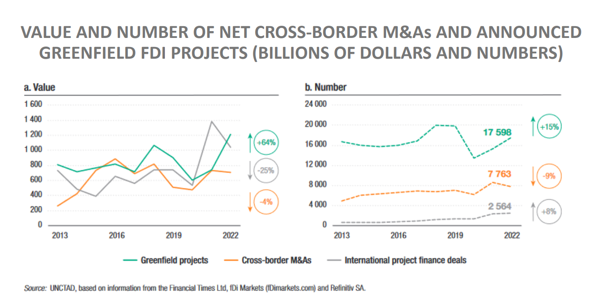

The slide suggests that in 2022 there's a strong preference or shift towards greenfield FDI projects, which are experiencing growth in both value and number. Conversely, cross-border M&As are seeing a decrease in both value and number, indicating a possible decline in these types of transactions or a shift in investment strategy towards building new facilities from the ground up (greenfield investments) rather than acquiring or merging with existing foreign businesses.

### National Investment Policies

There is a global trend towards more restrictive national investment policies in 2022. This could be due to a variety of factors, including but not limited to economic nationalism, strategic industries protection, or responses to economic challenges posed by the pandemic.

Regionally, there's variation in how these policies are distributed, with some regions being more active in policy changes than others. This could reflect differing regional responses to global economic conditions or shifts in regional investment attractiveness.

The overall theme indicates that policymakers are possibly reevaluating their approach to foreign investment, balancing the need for foreign capital and expertise against the desire for domestic control and benefits.

[Example: CFIUS - Committee on Foreign Investment in United States](https://www.skadden.com/insights/publications/2022/01/2022-insights/regulation-enforcement-and-investigations/cfius-goes-global)

Takeaways from the article:

- Since 2018, the U.S. and several other countries have **revised or installed national security-related screening of foreign direct investments.**
- Many jurisdictions now require filings for investments in the defense and security sectors, critical infrastructure, advanced technologies and sensitive personal data, or where state-backed investors are involved.
- While the CFIUS review process in the U.S. often remains the stiffest hurdle, the growing number of jurisdictions with similar regimes means that investors and parties to mergers must plan carefully for the review process.
- With the encouragement of the U.S. and EU, many reviewing authorities now frequently share information.

### New type of investments

1. Sovereign Wealth Funds

- Sovereign wealth funds (SWFs) are state-owned investment funds or entities that manage a country's reserves.
- Some well-known SWFs include: Norway Government Pension Fund Global, China Investment Corporation, Abu Dhabi Investment Authority, Kuwait Investment Authority, Hong Kong Monetary Authority Investment Portfolio.

2. Private Equity Funds

- A private equity fund is an investment fund that pools capital from investors to acquire equity ownership in companies, typically ones that are not publicly listed on stock exchanges.
- Well-known private equity funds are: KKR, Blackstone, Permira, Fortress, Bain Capital, and Carlyle (United States)

### How to assess the internationalization level of MNCs?

1. Number and size of foreign subsidiaries that are owned/managed by a MNC
2. Number of countries that a MNC is engaged with value-adding operations
3. Sahre of foreign assets, revenuem porfit & employment
4. Degree of internationalization of management/capital
5. Degree of internationalization of R&D (high value-added activities)
6. Extent & patent of systematic benefits that emerge from controlling & influencing a network of foreign economic activities
7. Degree to which the responsibility for certain activities is placed on foreign subsidiaries
8. Ratio of international market shares (RIMS) measured against the standard of a maximally internationalized firm

The case of DAX: DAX Management Board is becoming more international and the shareholders in DAX firms are mostly foreign

The case of PUMA:

**Vertical focus**

- Virtual/International Headquarters - decentralized competency centers located in germany, USA, Hong Kong
- Each of these functions is strategically positioned where management know-how and specialization is optimal

**Horizontal focus**

- Regional headquarters (Germany, USA, Hong Konga, Austria, Australia) serve as regional hubs in order to oversee distributors, licenses and other subsidiaries in these regions
- Dynamic reaction to regional and local specifications

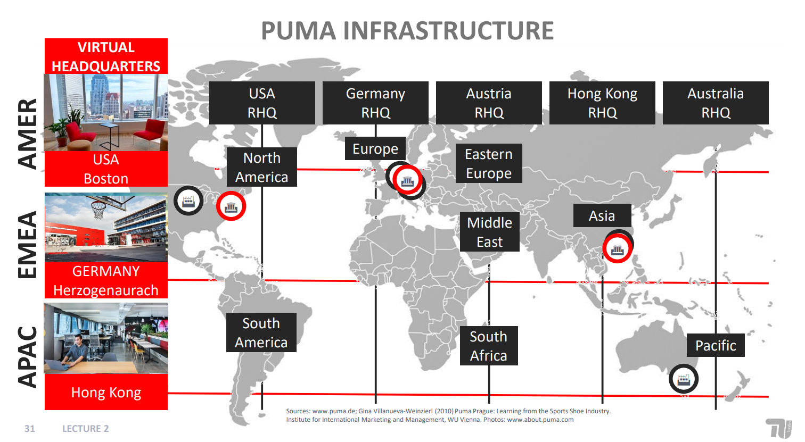

### Classification of Internationalization

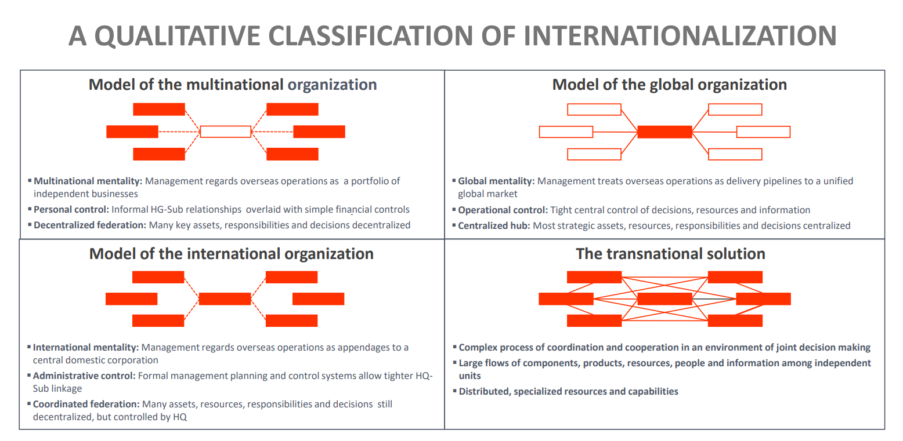

### Internationalization and Performance: S-Curve Hypothesis

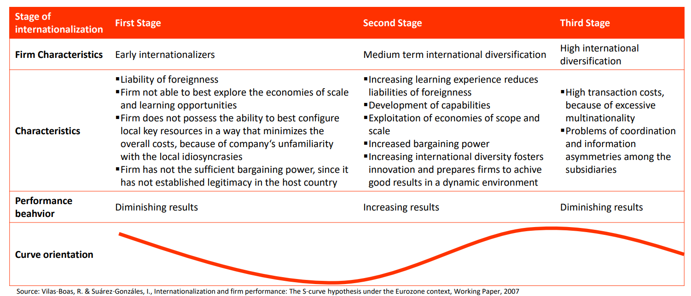

**Does this hypothesis hold true?**

> ... on a subsample of 32,835 multinationals from 64 countries, we find **no evidence of an S-shaped relationship**; nor do we see it in any of the single-country contexts.
> Our results show **no evidence of any within-firm effect of multinationality on performance**, highlighting the need for more contextually-grounded research focused on explaining between-firm effects to advance our theoretical and empirical understanding of the multinationality-performance relationship.
