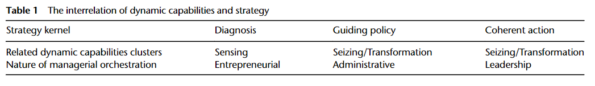
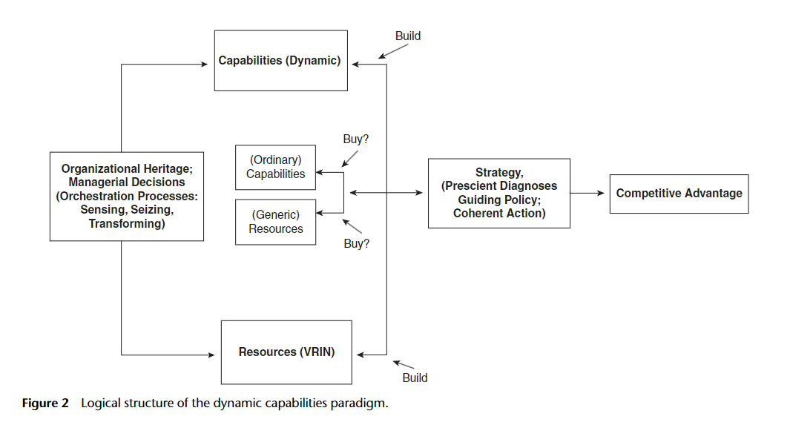
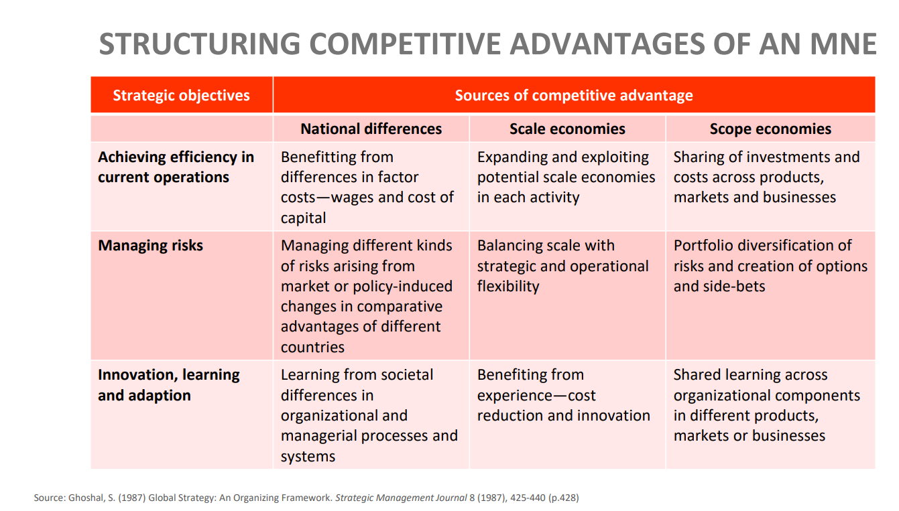
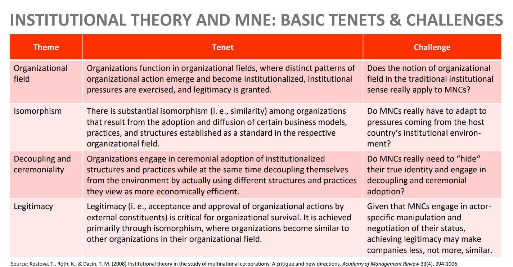
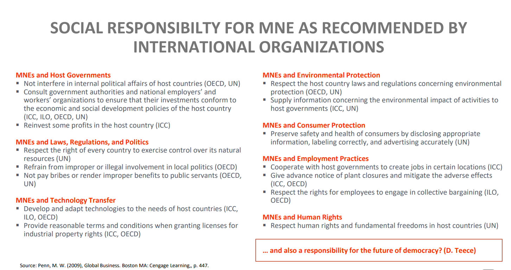

## The Dynamic Capability & Institutional View of the MNC

The paper by Teece (2014) seeks to fill in the gaps of the current theories on MNCs:

1. Unify different views on international business, connecting "internalization scholars" with "international management scholars" for a more cohesive field.
2. Integrate the study of multinational enterprises (MNEs) with strategic management, enhancing understanding of global competitive advantage.
3. Link international business theory with entrepreneurship, addressing calls for a dynamic approach to studying global markets.
4. Combine economic, organizational, and entrepreneurial theories to provide a comprehensive view of MNEs, showing how governance and dynamic capabilities together shape competitive advantage.

Teece starts the paper by making a review of a number of early approaches to the theory of the MNE, and then identifies various shortcomings, with hints as to how one might amend these deficiencies. The author mostly takes into consideration the internalization and transaction-cost based theories of MNCs, which suggest that the firm will internalize (bring within) those transactions that are too costly to conduct in a foreign market and because of what previous researchers regard as "market failures": these failures could be due to high transaction costs, unreliable suppliers, or the risk of revealing proprietary information.

According to the internalization theory, there are two ideas to internalization:

1. transaction costs/hold-up issues that are avoided by internalization.

2. resource transfer cost savings and learning issues, which are facilitated when technology transfers occur inside the MNE.

Some shortcomings of transaction-cost based theories:

1. Capabilities and learning unexplored
   Using the OLI paradigm, the author raises the question that ownership advantages are not clearly defined and previous theories have failed to include the firm's capabilties and learning as part of this.

2. Cross-Border Market Creation and Co-Creation Ignored
   The author tries to shift the focus of internalization theories with market failures and brings up the idea that the market hasn't failed but rather failed to emerge and needs to be created or expanded.

3. Entrepreneurship suppressed, equilibrium assumed, management muted, leadership ignored
   The author critizes traditional theories for failing to consider the role of entrepreneurship and organizational change in MNE, by focusing mainly on minimizing transaction costs and managing contractual risks, overlooking how firms explore and exploit new opportunities, innovate, and adapt to changes.

4. “Control” follows ownership of (foreign) subsidiaries; interfirm-relationships enigmatic
   The author points out that traditional theories that suggest that control comes directly from ownership of subsidiaries in foreign markets is flawed when considering cases like Apple, that doesn't own the supply chain and production facilities but is able to maintain control via networks (Global Value Chains, Global Factory) and relationships.

5. Competitive Advantage negleted
   The author mentions how traditional theories fail to consider the fact that MNE cannot build a competitive advantage only by governance structure, as this structure can easily be replicated by other firms - therefore not explaining how firms actually build competitive advantage and some outperform others.

### Towards a Capabilities Theory

Then, Teece sets the tone for his theory by pointing out that the essence of MNE is less about saving on transaction costs and more about being entrepreneurial and effective in the development, transfer, and orchestration of differentiated organizational and technological capabilities.

The (dynamic) capabilities framework is an entrepreneurial approach that emphasizes the importance of (signature) business processes, both inside the firm and also in linking the firm to external partners. It also recognizes the importance of critical resources and good strategy, by building on the _resource-based_ approach.

**What is a dynamic capability?**

A dynamic capability is “the firm's ability to integrate, build, and reconfigure internal and external competences to address rapidly changing environments"

#### Building Blocks

a. Processes (routines)

- coordination/integration
- guided learning
- reconfiguration/transformation

These processes are integrated into the day-to-day work (routine) of employees and supported by organizational values and strong leadership from the top management.

b. Position (resources)

- VRIN resources: valuable, rare, inimitable, nonsubstitutable which are _intellectual capital_ assets such as technology and know-how.
- The focus of the dynamic capabilities framework is on how firms can create, extend, integrate, modify, and deploy their resources and/or specific assets while simultaneously managing competitive threats and effectuating necessary transformations.
- Whereas other approaches emphasize tangible asset/resource ownership and protection, the dynamic capabilities perspective emphasizes intangible assets and resource augmentation, and also asset orchestration.

c. Paths (strategy)

- Strategy, when developed successfully, involves deploying the firm’s scarce assets to support market needs and gain advantage over rivals, while recognizing market and technological opportunities and any constraints imposed by the firm’s historical path of evolution.
- Strategy needs to be consistent, coherent, and embrace innovation.
- A good strategy has (kernels of strategy):

  1. prescient diagnose
  2. a guiding policy
  3. coherent action

- Dynamic Capabilities in this regard can be in 3 clusters to match the strategy kernels:

1. **Sensing:** Identification and assessment of opportunities at home and abroad
2. **Seizing:** Mobilization of resources globally to address opportunities, and to capture value from doing so
3. **Transforming:** Continued renewal

The table below illustrates this approach better:

### Ordinary Capabilities

- Operational capabilities
- Administrative capabilities
- Governance capabilities

Can be applied in these functional areas:

- Corporate functions
- Management Information
- R&D
- Operations
- Product Design Marketing
- Sales and Distribution

Ordinary capabilities simply allow an existing product or service to be made, sold, and serviced. They will not necessarily permit the MNE to grow except in environments with low competition, no technological disruptions, and very limited globalization.

What undermines the power of ordinary capabilities to serve as the foundation of competitive advantage for a particular MNE is that such capabilities can be imitated and transfered much more easily today than in earlier times.

An MNE subsidiary relying solely on strong ordinary capabilities in a particular host country will find, if the ordinary capabilities are imitable (e.g., via knowledge spillovers through employee turnover) and competitors can enter, that its advantage will steadily diminish. In short, ordinary capabilities will not support long-run competitive advantageunless competition is suppressed by governmentally or privately imposed entry barriers, or by weak physical and social infrastructure that prevents ordinary capabilities from quickly diffusing throughout the economy.

### Dynamic Capabilities

In the global economy today, the competitive advantage of the business firm appears to rest on the development and deployment of intangible assets, relationships, and human capital.

Dynamic capabilities tend to get built, are difficult to imitate, and cannot generally be bought. They are also very dependent on being developed based on the firm's values and history.

Dynamic capabilities also help characterize how an enterprise obtains strengths, extends these strengths (for instance by developing new business models), synchronizes business processes and models with the business environment, and/or shapes the business environment in its favor.

Firms with strong dynamic capabilities exhibit technological and market agility. To achieve this, they use less hierarchy.

Agility, coupled with the ability to sense new opportunities and threats, supports evolutionary fitness.51 This inevitably requires that firms constantly create new technologies, differentiated and superior processes, and better business models to stay ahead of the competition, stay in tune with the market, and even shape the market if necessary. The firm must be able to simultaneously cope with changes in the external environment and with changes caused by processes internal to the firm.

The chart encapsulated the logical paradigm of dynamic capabilities:

|   Strategic Capability    |            Organizational Characteristics            |                    Management Tasks                     |
| :-----------------------: | :--------------------------------------------------: | :-----------------------------------------------------: |
|  Global competitiveness   |  Dispersed and interdependent assets and resources   |    Legitimizing diverse perpectives and capabilites     |
| Multinational flexibility |    Differentiated and specialized susidiary roles    | Developing multiple and flexible coordination processes |
|    Worldwide learning     | Joint development and worldwide sharing of knowledge |    Building shared vision and individual commitment     |

### Side-by-side comparison

| Core building blocks |        Weak OC         |        Strong OC        |       Strong DC        |
| :------------------: | :--------------------: | :---------------------: | :--------------------: |
|      Processes       |   Sub-par practices    |     Best practices      |  Signature practices   |
|       Position       | Few ordinary resources | Many ordinary resources |     VRIN resources     |
|        Paths         |   Doing thing poorly   |   Doing things right    | Doing the right things |

### Capability-Based View vs. Internalization Theory

1. Leveraging Capabilities Through Horizontal Expansion

**Internalization Theory says:**

- Internalization theories help specify entry mode, but not the best direction and timing for expansion.

**Capability-Based Theory says:**

- MNEs succeed not just by choosing the right mode of entry but by effectively transferring and adapting their unique skills and assets to foreign markets, thus achieving competitive advantage.

2. How and When Do MNEs Enter New Geographic Markets?

**Internalization Theory says:**

- Focuses on minimizing transaction costs and governance issues as the primary drivers for global expansion, with less emphasis on the firm's unique capabilities or how these might be adapted or transferred across markets.

**Capability-Based Theory says:**

- FDI: When a firm has strong ordinary and dynamic capabilities, the incremental costs of FDI are likely to be low.
- Joint ventures: When timing is of the essence and certain capabilities are absent, joint ventures are likely to be preferred by the enterprise endeavoring to go global.

**Born Globals**
The “born global” phenomenon is consistent with dynamic capabilities. Small companies can have strong dynamic capabilities, and may be able to access abroad the ordinary capabilities necessary to make their foreign market-entry strategies viable. Small entrepreneurial firms can quickly create and (with local partners) co- create new markets abroad.

3. The Role of Headquarters and the Subsidiary in Dynamic Capabilities Theory

**Internalization Theory says:**

- The governance (transaction cost) theory of internalization has little to say about the role of headquarters and foreign subsidiaries.

**Capability-Based Theory says:**

- Headquarters can enhance the firm’s capabilities by allowing and facilitating technology transfers among the divisions, and by encouraging the use of resources that work well together.
- MNE’s subsidiaries in that they can be seen to contribute to the competitive advantage of the MNE: generate know-how, accummulation of firm-specific assets.

4. Global Distribution of R&D and Innovative Ecosystems

**Internalization Theory says:**

- Governance (transaction cost) theory produces only limited insight into this phenomenon.

**Capability-Based Theory says:**

- Asset augmentation comes fundamentally from R&D and learning processes (e.g., learning by doing; learning by using), whether internal or from (and with) partners, and from applying the logic of the “profiting from technological innovation” paradigm.

5. Location and “Country” Factors and MNE Theory

**Internalization Theory says:**

- Internalization theory will help determine whether economic activity is best accessed via outsourcing or by FDI.

**Capability-Based Theory says:**

- While country and regional factors may impact investment location decisions, they usually have little relevance to understanding how MNE competitive advantage is anchored.

- Country and regional factors can be foundational for MNE competitive advantage only when a particular MNE is able to access local advantages and avoid local disabilities in a way that others cannot (or fail to) copy.

### Competitive Advantages of MNE

### Institutional Theory of MNCs

### Social Responsibility of MNCs

### Conclusion of Teece's paper

Where certain capabilities and markets are absent, they need to be created. In these environments, entrepreneurs and managers in parents and subsidiaries build signature processes, deploy distinct resources, and design good business models and
strategies in pursuit of profits.

The basic question to be answered by a robust theory of the MNE is not simply where to locate in order to minimize production and transaction costs, but where to locate to build or deploy signature processes and obtain market access while guarding intellectual property and leveraging the firm’s existing VRIN resources into new business/market environments.
