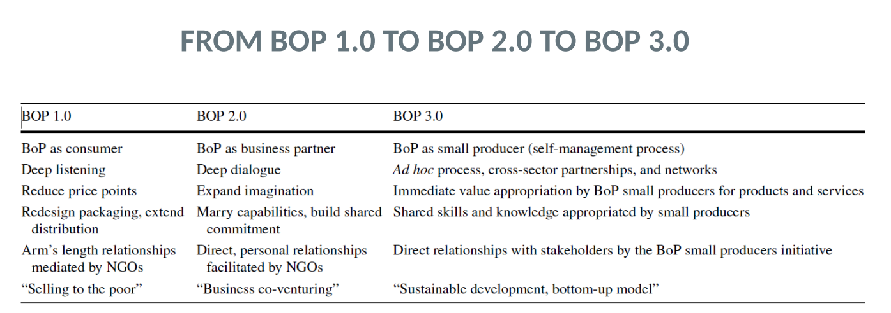

## 4a: The MNC as Spearheads of Imperialism

### Overview

**Imperialism theorists:**

1. Hobson
2. Schumpeter
3. Lenin

Reasons for imperialistic expansion:

1. Stagnant domestic demand (underconsumption)
2. Dominance of heavy and defense industries
3. Racially grounded superiority
4. Plutocratic regimes
5. Capital investment spillover (oversavings)

Conclusion: The reasons for imperialistic expansion are rooted in the social system (macro level)

**Dependecy theory talks about the consequences of imperialistic expansion:**

1. Dependency
2. Structural defects
3. Exploitation

Suggestion: Protectionism and decoupling from the global market

### Imperialism Theory

**Genesis:** Classic imperialism refers mainly to pre-war (WWI) Africa where Africa was divided into colonies after the Berlin Conference of 1884 - Meeting at which the major European powers negotiated and formalized claims to territory in Africa

#### John Atkinson Hobson - The classical of the "bourgeois" theories of imperialism

**Who was Hobson?**

- Economist and politician of the left wing British Liberal party
- Observer of Boer War in South Africa as correspondent of the Guardian
- Opponent of imperalistic policy and asserter of unrestricted free trade
- Most famous publication "Imperialism - A Study (1902)"

He was a critic of imperialism theory and outlined the following socioeconomic factors leading to imperialistic expansion:

1. **Plutocratic Social Structure in Great Britain**: Hobson observed that wealth was concentrated in the hands of a few, creating a class of rich elites.

2. **Unequal Distribution of Income and Consuming Power**: This wealth concentration led to an imbalance in the economic power and consumption capabilities among the population.

3. **Oversaturation of Domestic Market**: Due to the unequal distribution of wealth, the domestic market became oversaturated; there was more supply than the underpowered consumer demand could support.

4. **Seeking Investments Overseas with Governmental Aid**: As a result, these wealthy elites, along with the government's help, looked to foreign markets for investment opportunities to maintain their wealth and power.

5. **Colonial Investment Often Costly and Not Profitable**: Hobson argued that these colonial investments were often expensive and not necessarily profitable in the economic sense.

6. **Call for Internal Reallocation and Abolishment of Anachronistic Political Structure**: He advocated for a redistribution of wealth within the country and the reform of outdated political systems that supported such imperialism.

#### Joseph Schumpeter - Critical of Imperalism Theory and Representative of Free Trade

**Who was Schumpeter?**

- Austrian economist and politician
- Coined the term "dynamic entrepreneur" and "creative destruction" of the free market
- Most famous publication "Capitalism, Socialism and Democracy"

He was also a critic of imperialism and viewed it as below:

a. Feature of monopolistic capitalism marked with tariffs, barriers, cartels etc.
b. Relict of pre-industrial times and political structures
c. Driven by aristocrastic ruling classes with aggresive tendencies

He contrasted the point above with modern capitalism, which he viewed as below:

a. Liberal, cosmpolitan and peaceful society
b. Characterized by unrestricted economic, intellectual and cultural exchange

**Conclusion:**

“In a purely capitalist world, what was once energy for war becomes simply energy for labor of every kind.”

Schumpeter believed that in a truly capitalist society, energies once used for warfare would be redirected towards productive work.

#### Lenin - Imperialism is the highest stage of capitalism

**Who was Lenin?**

- Real name is Wladimir Iljitsch Uljanow
- Communist politician and Marxist theorist
- Founder of the Soviet Union

Lenin was critical of imperialism, viewing it as an exploitative relationship that benefited capitalist countries at the expense of less developed nations. He viewed it as below:

1. Concentrated production and capital leading to monopolies with significant economic power.
2. A merger of bank and industrial capital, creating a financial elite or oligarchy.
3. The export of capital being prioritized over the export of goods.
4. The emergence of international monopolist capitalist associations dividing the global market.
5. A complete territorial division of the world among the largest capitalist powers.

**Conclusion:**
His analysis suggested that imperialism was an inevitable extension of advanced capitalism, where the need for new markets and resources would drive nations to exert control over others.

### Imperialism Expansion vs Today

Here we compare the reasons for geographical expansion (Imperialism theories) and show today's relevance of these factors:

- _Stagnant domestic demand_ that led to seeking markets abroad, today this is addressed through _better domestic social policies and stronger unions._
- _The past dominance of heavy & defense industries_, contrasts with _technological advancements fostering new key industries._
- _Racial superiority ideologies_ contrast with the _ideology of "melting pot", more inclusive and multilateral global cooperation._
- _Plutocratic regimes_ of the past, contrast with the _democratization of society today._
- _Capital investment spill-over_ from imperialism _is partly still true_, with capital often moving across borders seeking higher returns.

### Free Trade and Imperialism Theory

**British colonial policy:**

Reference publication - "The Imperialism of Free Trade" by John Gallagher and Ronald Robinson

- Used free trade to maintain and extend its influence without formal colonization.
- Exploiting technological advantages, investing heavily in foreign economies, and cultivating local elites to align with British interests.
- _Informal empire_: “British policy followed the principle of extending control informally if possible and formally if necessary.”

**American Enterprises in Europe in 1960s:**

Reference publication - Jean-Jacques Servan-Schreiber's book, "The American Challenge"

- During the 1960s, there were concerns in Europe regarding the U.S. industrial presence and influence.
- American industry seeks to expand in Europe due to its technological and managerial superiority

#### Instruments of Informal Imperialism:

1. Intensive trade by exploiting the technological advantages of the home country
2. Penetration of host economy with high direct investment
3. Acquisition of indigenous interest groups and elites to cooperate with the metropolis

### Dependency Theory and the Rise of Neo-Marxism

**Who was Guevara?**

- Ernesto "Che" Guevara was a marxist revolutionary, guerilla leader and author.
- Central leader of the rebel army of the Cuban Revolution, along with Fidel Castro

Tom Kemp (1967) critizied the close relation of the MNCs with the state, due to the fact that the state is involved directly in the economic disputes to promote the process of capital accumulation - not only to defend the general legal requirements for private property.

**Other spin-offs:**

1. Magdoff - Persisting dependence of colonized countries even after formal end of colonial rule due to manipulative economic practices
2. Nkruhmar - Neo-colonialism is seen as an indirect exploitation of undeveloped countries via:

- Unequal trade relations
- Artificial deterioration of terms of trade to the disadvantage of developing countries
- Development aid

3. Formally, the developing countries governments are independent, but they are submissive to the capitalist interest of developed countries

The case of Shell in Nigeria

### Perspectives

**Marxist & Neo-Marxist perspective on imperialism:**

1. Neo-imperialism as the highest stage of capitalism, where multinational corporations play significant roles in maintaining economic dependencies.
2. The systematic exploitation of developing countries, leading to their continued underdevelopment.
3. The employment of local government officials by MNCs, indicating a direct interest in the dependency of developing countries.

**Empirical Research and Case Study Analysis:**

1. Case studies examining the macroeconomic effects of imperialism, such as employment and trade balance.
2. The impact of technology transfer and know-how, particularly through licensing and joint ventures.
3. The risk-taking behavior of corporate services.
4. Cultural changes in developing countries due to imperialism.
5. The retroactive effects on industrialized countries, like the outsourcing of jobs.

**Conclusion:**
Historical imperialist practices have evolved into economic strategies that maintain dependency, with modern corporations playing a crucial role in this dynamic.

### Good Governance vs Bag Governance

**Good Governance has a positive impact on FDI inflows to developing countries via:**
a. Governance Matters Index indicators: political stability, government efficieny, rule of law, corruption control
b. Human Development Index indicators: life expectancy, literacy rate, per capita income
c. Environmental Sustainability Index indicators: level of pollution, environmental protection measures
d. Democratic System of Government: guarantee of the private rights such as protection of property
e. Copyright protection

**Bad Governance has a negative impact on FDI inflows to developing countries via:**
a. Corruption:

- Utilization of public resources for private gain
- Arbitrary corporate taxation without return service guarantee

b. Pollution havens:

- Assumption: Low environmental standards in developing countries attract direct investment from heavy polluting industries could **not be confirmed**.
- Reasons:
  - Pollution havens have high political risk and lack of resources & infrastructure
  - Compliance with local environmental standards is less expensive than FDI

---

## 4b: The MNC as Development Enablers of the Third World

Most companies focus on mature and emerging markets, while the huge survival market goes largely untapped.

C.K. Prahalad: Start recognizing the poor as resilient and creative entrepreneurs to open new opportunities.

### Bottom of the Pyramid (BOP) Approach

1. Development aid is not sustainable: invest instead of giving money

2. Profitable businesses are sustainable: promote entrepreneurship to support social mobility and stabilize a region

3. C.K Prahalad says:

- The poor are a viable market
- ICT development can make a difference

### Missing recongition due to previously held assumptions

Assumption #1: The poor are not our target customers, they cannot afford our goods & services.

Implication: Cost structure cannot serve BOP market.

---

Assumption #2: The poor do not have use for thse products sold in developed countries.

Implication: Sanitation that is needed by the poor is not in the format we offer - format over functionality mindset.

---

Assumption #3: Only developed countries appreciate and pay for technological advancements.

Implication: BOP don't need advanced technology, and cannot be source of innovation.

---

Assumption #4: BOP market is not critical for long-term growth and vitality of MNCs.

Implication: BOP markets are at best an attractive distraction.

---

Assumption #5: No intellectuals in BOP markets, e.g. managers.

Implication: Cannot assign best people to work in BOP markets.

---

### Innovating in BOP markets needs:

1. Price performance of products and services
2. Usage of innovative (IC) technologies in combination with existing and rapidly evolving infrastructures
3. Scalability of solutions across countries, cultures and languages
4. Focus on conserving resources: eliminate, reduce and recycle
5. Understanding of functionality, not just form
6. Processes and logistics infrastructures as critical as product innovation
7. Deskilling work
8. Education of customers on product usage
9. Products must work under hostile environmental conditions
10. Focus on the broad architecture of the system so that new features can easily be incorporated

#### The case of Tata Nano (frugal innovation)

- Failed to create a mass market
- Cutting corners to make it cheaper, there were safety issues
- New regulations will make it expensive to produce, therefore raising the price

#### The case of Hindustan Unilever Project Shakti

- Empowering women in remote villages
- Trained, taught them business and sales and products
- Give additional income to their families
- Reach remote villages that would be inaccessible by the traditional distribution system

#### The case of Grameen Bank

Main idea: Encourage and financially support people to take initiatives in business or agriculture to enable earning, payoff debt and prosper.

- Founded by Bangladeshi economist Muhammad Yunus
- Traditional banks don;t give small credit to poor people - gave birth to the micro-credit
- Solidarity lending model: people are assigned to groups of 5 and get credit if the others bail for them
- The system works based on trust, not contracts
- Loans are given for 1 year, interest rate is 20%
- Repayment is 2% of the loan weekly
- Requirement to save 5% of the loan amount
- Borrowers become owner and hold shares in Grameen Bank

### Effectiveness of the Bottom of the Pyramid Approach

The "Bottom of the Pyramid" (BoP) concept evolves from viewing low-income communities primarily as consumers (BoP 1.0) to engaging them as business partners (BoP 2.0), and finally to empowering them as small producers and entrepreneurs (BoP 3.0). Each stage represents a deepening of engagement and a shift in strategy:

BoP 1.0: Companies focus on making products affordable, through cost-cutting and distribution innovations, essentially "selling to the poor."

BoP 2.0: The relationship evolves into co-venturing, where businesses and local communities work together, sharing capabilities and commitments.

BoP 3.0: The approach integrates the local communities into the value creation process itself, promoting sustainable development through a bottom-up model, where the local producers are directly involved in the management process and value capture.

**Is BOP Approach Successful for MNCs?**

The case of HP: e-inclusion project was shut down because its objectives didn't align with company mission.

The case of P&G: Water purification powder was a commercial failure, distributed by a philanthropic enterprise.

The case of DuPont: Tried opening new markets by selling soy-fortified snack foods in India, but there was no profitability.

The case of SC Johnson: Community Cleaning Services project turned into non-profit due to having no profits.

**Conclusion:**
No evidence that the BoP approach has delivered on its promise that businesses can serve BoP markets profitably and to BoP participants that they involvement of MNCs will alleviate poverty. Apart from some successes in industries such as telecommunications, fast-moving consumer goods, and pharmaceuticals, global corporations have been largely unable to reduce costs and prices enough to serve poor consumers.

### Three Approaches to Achieve Sustainable Margins

1. Bundled Products: Packaging several product functions together creates a richer experience and improves their access to nedded products - and allows companies to sell more per transaction.

2. Enabling Services: Provide services along with the product, CEMEX vase of providing architectural services with the sale of cement for Mexican consumers.

3. Customer Peer Groups: Associations of customers provide additional value and help aggregate sales, therefore reducing costs - the case of peer groups in Grameer Bank.
