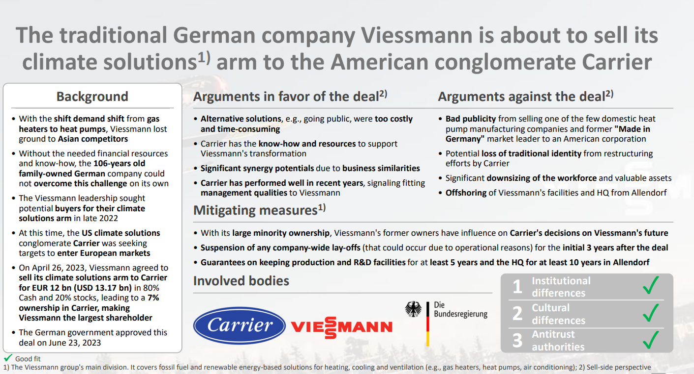

## Modes of Market Entry: Cross-border Mergers & Acquisitions

### Distinguishing factors between national deals and cross-border M&A

Differences between cross-border and doemstic M&A tend to be under-researched. There are assumptions that there are relevant differences such as complexity, regulatory issues, liabilty of foreigness and double layered acculturation issues.

**Studies say:**

a. Ethnographic studies by Reynolds & Teerkangas show that even domestic M&A are influenced by international aspects such as: context, strategic orientation, talent management, work processes, output.

b. Banking industry study by Calazza shows that domestic and cross-border M&A do not differ much, except the fact that banks that bid cross-border are larger and relatively more liqiud and better capitalized.

c. Study by Anand says that Acquirers attempt to enhance their capabilities (R&D, product quality, cost efficiency, product line expansion) and are rewarded by capital markets when they merge with a target which is multinational geographic scope - meaning that the multinational scope is more relevant than the country of origin of the target.

d. Study by Erel says that cross-border M&A increases with:

- geographic proximity
- intensified bilateral trade flows
- higher accounting standards in Acquirer's country
- higher corporate tax rate in the Acquirer's country
- exchange rate fluctations prior to deal
- superior performing stock market in the Acquirer's country
- differences in the countries' market-to-book ratio (MTB)

e. Study by Francis says similarity between accounting standards determines the probability of cross-border (IFRS introduction in 2005).

f. Study by Li says that there are delays in closing deals if the foreign bidder firms are state owned.

g. Other differences may be the impact on public opinion and the legitimacy aspect (CFIUS and "The American Challenge")

### Literature selection: Shimizu et. al.

Literature in cross-border M&A is weak and often mixed with other topics. The study by Shimizu et. al. (2004) is the study that tries to analyze cross-border M&A structure.

#### Research field

Based on Shimizu study, the research field can be divided into:

1. Cross-border M&A as a specific foreign market entry mode

- Firm-level factors
- Industry-level factors
- Country-level factors

2. Cross-border M&A as a dynamic learning process

- Due-diligence process
- Negotiation process
- Post M&A integration process

3. Cross-border M&A as a value-creating or destroying business strategy

- Wealth creation by M&A - "announcement effect"
- Post M&A performance - "long-term effect"

#### The procedure of M&A (Zhou et. al. 2016) is as follows:

### Cross-border M&A as a specific mode of foreign market entry

### Cross-border M&A as a dynamic learning process

### Cross-border M&A as a value creating/destroying strategy

### Improving research in M&A

1. Inclusion of moderators

2. Refining measurement

### Research Areas

- Understanding M&A capabilities
- Analyzing the relationship between M&A activities and Corporate Social Responsibility and/or sustainability aspects
- Investigating the imapct of digitalization
- M&A activities in times of de-globalization/de-coupling

### Conclusion

- Research has increased into cross-border M&A since 2004 but not easy to find
- There are a lot of theories with some conflicting predictions/hypothesis
- Empirical studies tend to be conflicting
- Even single studies have different degrees of confirmation of hypothesized relationships
- Specification of independent and depended variables is often on uncertain theoretical grounds

The case of Bayer-Monsato merger

The case of Viessmann - Carrier

