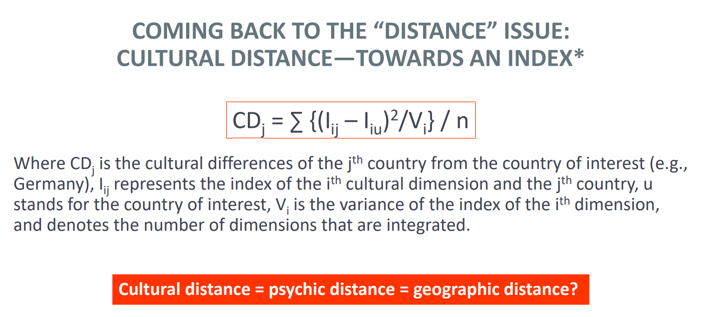

## Culture and the Role of Distance

### Distance defined

“Essentially, international management is management of distance.” Zaheer (2012)

Distance is defined as a numerical measurement of how far apart objects or points are. In the context of IB studies, there are two basic concepts with three properties:

a. Geographical (physical) distance between 2 or more locations

- Symmetric
- Continous
- Stable over time

b. Distance as a metaphor for the kinds and varying degrees of differences

- Asymmetrical
- Non-continuous
- Can change over time

### CAGE Framework by Pankaj Ghemawat

Pankaj Ghemawat's "CAGE" framework is a tool used by companies to assess the distance between countries and the potential impact on business. "CAGE" is an acronym for Cultural, Administrative, Geographic, and Economic distance.

1. Cultural Distance: This includes differences in language, ethnicity, religion, social norms, and values. Cultural distance can affect consumer preferences and the functioning of business relationships. Cultural differences matter the most when:

- Products have high linguistic content (TV programs)
- Products matter to cultural or national identity (foods)
- Product features vary in terms of:
  - Size (cards)
  - Standards (electrical equipment)
- Products carry country-specific quality associations (wines)

2. Administrative Distance: This covers the presence or absence of shared colonial ties, political associations, government policies, legal systems, and institutional weaknesses or strengths. It also includes trade arrangements, political hostility, or support. Government involvement is high in industries that are:

- Producers of staple goods (electricity)
- Producers of other “entitlements” (drugs)
- Large employers (farming)
- Large suppliers to government (mass transportation)
- National champions (aerospace)
- Vital to national security (telecommunications)
- Exploiters of natural resources (oil, mining)
- Subject to high sunk costs (infrastructure)

3. Geographic Distance: Beyond simple physical distance, geographic factors such as common borders, access to waterways, size of the country, topography, and transportation infrastructure also play a role in the connectivity between countries. Geography plays a more important role when:

- Products have a low value-to-weight or value-to-bulk ratio (cement)
- Products are fragile or perishable (glass, fruit)
- Local supervision and operational requirements are high (many services)

4. Economic Distance: This refers to differences in consumer incomes, costs, and resources between countries. It includes disparities in wealth, natural resources, financial resources, infrastructure, and other economic factors. Economic differences have the biggest impact when:

- The nature of demand varies with income level (cars)
- The economics of standardization or scale are limited (cement)
- Labor and other factor cost differences are salient (garments)
- Distribution or business systems are different (insurance)
- Companies need to be responsive and agile (home appliances)

### Culture defined

Culture is the collective programming of the mind which distinguishes members of one group or category of people from another.

- Is not innate, it is learned
- Is transmissible
- Is dynamic
- Facets of culture are interrelated
- Is ethnocentric

**There are multiple interacting spheres of culture:**

1. National & regional: geography, history, political & economic forces, climate, religion, language
2. Industry: resources, technology, market, regulations
3. Professional: education, training
4. Functional: external environment, nature of task, time horizon
5. Company: founder, leader, stage of development
6. Other: family, associations etc.

### Where Company Culture Began - McKinsey 7s Model

1. Strategy: The integrated vision and direction of the company as well as the manner in which it communicates and implements that vision and direction.
2. Structure: The form of the organizational chart and interconnections between positions in the organizational hierarchy.
3. Systems: The procedures and routine processes required to perform the work, including the ways information moves through the organization.
4. Staff: The personnel categories within the organization, e.g. marketeers, engineers.
5. Style: The characterization of the ways key managers set priorities and behave in order to achieve the organization's goals.
6. Skills: The distinctive capabilities of the organization as a whole.
7. Shared Values: The core beliefs underlying the organization's existence and its expectations of its members. Values act as an organization's conscience and provide guidance in times of crisis.

### Culture Types

Categorizing corporate cultures based on two dimensions: the speed of feedback and reward, and the level of risk:

1. Work-hard, play-hard culture: This culture is characterized by rapid feedback and reward, but low risk. Industries such as real estate, computer technology, and car dealerships might fit into this culture because employees often see the results of their work quickly and there's a strong emphasis on high energy and immediate rewards, but the individual risks involved are relatively low.

2. Tough-guy macho culture: These are high-risk environments where feedback and reward are also rapid. Examples given include construction, entertainment, and management consulting, where the stakes and potential rewards are high, but so are the risks of failure.

3. Process culture: Here, feedback and rewards are slow, and the risk is low. Industries like banks, insurance companies, and utilities require steady, consistent processes with less frequent feedback on performance and lower inherent risk.

4. Bet-the-company culture: In these cultures, the feedback on decisions may be very slow because the outcomes of strategic decisions may take a long time to materialize. However, the risk is very high, as decisions often involve large amounts of resources and significant consequences for the company. Industries such as oil, architecture, and capital goods are included, where investments are substantial and may take years to pay off.

### Methods of discovery

1. Artifacts & behaviour
2. Observation
3. Beliefs & values
4. Interviews & surveys
5. Assumptions
6. Inference & interpretation

### Can Organizational Culture be Changed?

1. Culturalist View

- This viewpoint sees culture as a product of long-term evolution and thus inherently resistant to change.
- Attempts to alter culture are viewed negatively, as they are seen as meddling with established and valuable traditions.

2. Realistic View

- The realistic perspective acknowledges that culture has evolved in a certain way due to its history (path dependency).
- Critique of the current culture is not dismissed outright and is seen as a potential catalyst for change.
- However, any change is expected to be a lengthy and incremental process, rather than rapid and revolutionary.

3. Technocratic View

- This viewpoint takes a more mechanical approach to culture, treating it as something that can be completely controlled and systematically changed, similar to other systems within a company.
- It assumes that with the right methods and enough control, any aspect of the business culture can be fundamentally transformed.

### Cross-Cultural Frameworks: Hofstede Study

a. Hofstede framework
b. Schwartz value survey
c. Globe
d. WVS-EVS

#### Hofstede study (1980): Cultural Dimensions of Management

Hofstede study was a survey of 116k employees in IBM in 60 countries. It seeks to measure culture in 6 dimensions:

1. Power distance: The extent to which people accept that power is distributed unequally

- Employees being afraid to express their disagreement with their managers
- Leader’s decisions are made autocratic or paternalistic
- Power distance or tolerance for power differences

2. Collectivism vs individualism: The degree to which individuals are integrated into groups

- Job that has work-life balance
- Freedom in your job
- Have challenging tasks whose fulfillment give you feelings of achievement

3. Uncertainty avoidance: The society’s tolerance for uncertainty or ambiguity

- Stressful work environment
- Behavior towards breaking company rules
- How long to continue working in the company

4. Feminity vs Masculinity: Refers to the distribution of roles between the sexes

- Feminity:

  - Good working relationship with the manager
  - Work with cooperative people
  - Live in a nice and friendly environment
  - Have job security

- Masculinity:

  - Opportunity for high earnings
  - Get recognition when you do a good job
  - Achieve higher positions in the company
  - Challenging work and satisfying job

5. Long-term orientation: time horizon people have in mind when they think about the future

- Are quarterly results more important than long-term development of the company
- Does the company have responsibilities for future generations

6. Indulgence: In an indulgent culture it is good to be free. Doing what your impulses want you to do, is good. Friends are important and life makes sense.

- In a restrained culture, the feeling is that life is hard, and duty, not freedom, is the normal state of being.

#### Results

The USA has a high score in Individualism (91) indicating a highly individualistic culture, whereas Asian countries like Japan, Taiwan, and South Korea have lower scores, indicating a more collectivist culture.

**Indulegence Data:** Americas, Australia and certain African countries are more indulgent than central and eastern Europe and Asia, which in turn are more restrained.

### How Cultures Influence Behavior & Outcomes

There is a conceptual model from a study by Mitchell et al. (2000) on how cultural values influence entrepreneurial behavior and decision-making processes.

1. Values: This refers to cultural values such as individualism and power distance that are ingrained in a society. These values shape the way individuals think and act within that culture.

2. Cognitions: These are mental processes that are influenced by cultural values and include three types of 'scripts':

- Arrangement scripts: These are the knowledge structures that individuals use to understand how to use contacts, resources, and assets necessary to create a new venture.
- Willingness scripts: These scripts are related to the individual's commitment to starting a new venture and their openness to the idea of entrepreneurship.
- Ability scripts: These refer to the knowledge structures regarding the skills, knowledge, norms, and attitudes required to create a venture.

3. Outcomes: The interaction between cultural values and cognitions leads to certain outcomes, such as the decision to create a venture.

### Critical Points Regarding Hofstede's study

- Biased Results: one 1 company was surveyed
- Dimensions: biased towards western culture & not clearly defined (overlapping)
- Cultural values: the study focused on behavioral aspects instead
- Managerial context: not generalizable to the overall country culture
- Cultural pheonmena cannot be identified by pure statistical measures
- Assumption that Culture equals Country

### Future Research Directions in Culture

1. Include non-value aspects of culture such as beliefs and norms
2. Not assume that culture equals country
3. Consider multiculturalism
4. Investigate cultural change due to rapid economic changes
5. Move beyond survey-based and self-report metrics
6. Investigate how global teams navigate cultural differences

### Institutional Variables and the relation to Hofstede indices

1. Religion

- Roman Catholicism, Islam, and Hinduism tend to have high power distance whereas Protestantism prefers low power distance.
- Catholicism has high uncertainty avoidance whereas Protestantism, Buddhism and Islam have low uncertainty avoidance.
- Catholic traditions are more masculine than Protestant traditions.
- Religion can affect individualism through the belief of individual relationship with God.

2. Language

- Countries that use pronoun drop languages (Arabic, Spanish, and most Asian languages) have lower individualism and higher power distance scores.
- The languages with more than two second-person singular pronouns (Arabic, German, and Spanish) have higher uncertainty avoidance measures.

3. Climate

- Warm climate favors masculine culture and high power distance.

4. Ethnic heterogeneity

- Ethnic diversity matters for cultural dimensions.
- Collectivism is associated with homogenous cultures.
- Countries with more immigrants have lower power distance.

5. Legal system

- High uncertainty avoidance is associated with many and precise laws and regulations in a country.

6. Female labor participation

- Masculinity reflects gender difference in work-related values.

7. Confucianism

- The philosophy of Confucius has significant impact on the long-term orientation of East Asian countries.

### Economic Variables and the relation to Hofstede indices

1. Individualism and GDP per capita: The higher the GDP per capita, the more individualistic the country's culture is.
2. Power Distance and GDP per capita: The higher the GDP per capita, the lower the power distance is.
3. Uncertainty avoidance and GDP per capita: The higher the GDP per capita, the lower the uncertainty avoidance is.
4. Masculinity and GDP per capita: Not much difference between low and high GDP
5. Long-term orientation and GDp per capita: Not much difference between low and high GDP

### Measuring Cultural Distance

### Cultural Distance applied in academic research

a. Cultural distance and the launch/sequence of foreign investments

1. Firms are less likely to invest in culturally distant markets.
2. Firms tend to progressively expand from their home base into countries with greater cultural/psychic distance.

b. Cultural distance and entry mode

1. Firms tend to incrementally increase in investment commitment from exports into FDI. This evolution may occur in tandem with the increase in cultural/psychic distance.
2. The higher the cultural/psychic distance, the more control the MNE is likely to maintain over its foreign operations.
3. Multinationals prefer to enter culturally distant countries through greenfields rather than through acquisitions.

c. Cultural distance and affiliate performance/knowledge transfer & interrelationships

1. The higher the psychic/cultural distance, the more limited the ability of a MNE to generate rent when entering new domains.
2. The higher the cultural/psychic distance, the more difficult it is to develop trust and productive relationships, which in turn reduce the amount of knowledge transfer
