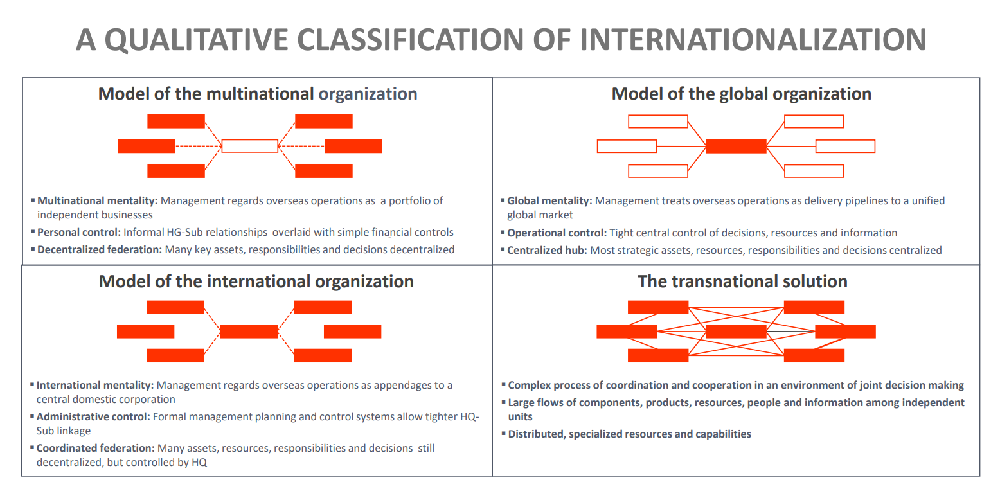

## The role of the HQ and foreign subsidiaries

### Mechanism Types

There are two types of mechanisms coordinating foreign subsidiaries:

a. Structural and formal mechanisms:

- Grouping of organizational units (departmentalization)
- Centralized or decentralized decision-making through a formal hierarchy
- Formalization and standardization (written policies, rules, job descriptions, procedures, manuals etc.)
- Planning (strategic planning, budgeting, functional plans, scheduling etc.)
- Output & behavior control (financial performance, technical reports, sales & marketing data, direct supervision)

b. Informal and subtle mechanisms

- Cross-departamental relations (direct managers, temporary or permanant teams, task forces, committee etc.)
- Informal communication (contact among managers, work trips, meetings, conferences etc.)
- Socialization by building organizational culture through shared strategic objectives and values by training, career paths, reward systems etc.

### Strategy and Structure: Stopford-Wells Model

This is a framework developed to understand the strategy of MNCs based on their degree of product diversity and the % of sales outside their home country. This model suggests that as companies grow and expand internationally, they evolve through different organizational structures:

1. International Division: When a company first begins to export, it might create an international division that handles all non-domestic business.
2. Area Division: As foreign sales grow, companies may move to an area division structure where operations are organized by geographic region. This allows for better focus and adaptability to the local market.
3. Worldwide Product Division: When a company has a diverse range of products, it may adopt a product division structure. Each product division is responsible for the global operations of its product line, centralizing knowledge and expertise about the product.
4. Global Matrix or Grid: At high levels of foreign sales and product diversity, companies adopt a matrix structure, which combines both product and geographic divisions. This allows for efficient management of the diverse products across different regions.

### Planning & Budgeting: The Lessard-Lorange Model

This is a conceptual framework used for planning and budgeting in international finance, for MNCs dealing with multiple currencies. It addresses the complexities that arise due to fluctuating exchange rates when converting financial results from one currency to another. This model, considers 3 different exchange rates for translating budget and actual performance:

1. Initial t0: The exchange rate at the beginning of the budget period.
2. Projected t0: The exchange rate projected at the beginning of the budget period for the end of that period.
3. Ending t1: The actual exchange rate at the end of the budget period.

### Personel Transfer

1. Ethnocentric Approach: transfer of the superior corporate culture of the home country abroad

**Advantages:**

- implementation of a uniform corporate policy
- facilitates communication & coordination with the parent company
- compensates for the lack of suitable managers abroad

**Disadvantages:**

- conflicts between leaders and guided parties
- little knowledge of host country market
- unequal distribution of incentives

2. Polycentric Approach: management positions are to be filled with local staff

**Advantages:**

- motivation for local managers
- no cultural or language barriers
- no preparation programs
- use of local knowledge of the market
- relief in dealing with politically sensitive issues
- no special surcharge for salaries

**Disadvantages:**

- possible problems in coordinating with the parent company
- possible loyalty problems
- non-sufficient suitable candidates

3. Geocentric/Synergistic Approach: managers evaluated on performance not nationality

**Advantages:**

- available candidates through the development of the international management pool
- avoidance of national identification
- transfer of knowledge between subsidiaries

**Disadvantages:**

- high costs
- no familiarity with specific market conditions
- high demands for managers (and their families) to adapt
- issues may arise due to identity determination of national subsidiaries

## Perspective of Corporate Headquarters (CHQ)

a. Multibusiness Firm

- Typical CHQ terms: corporate center, corporate headquarters, parent company
- Intellectual roots: Noted thinkers like Chandler, Drucker, Lawrence and Lorsch, Sloan.
- Perspective on the CHQ: Emphasizes the CHQ's importance to create value, its control and top-down management.
- Topics: Focuses on roles and design of CHQ, firm boundaries, resources, and capabilities, along with the value CHQ adds or destroys.
- Theories: Grounded in transaction cost economics, agency theory, and dynamic capabilities.
- Methods: Involves qualitative fieldwork, quantitative analysis, and conceptual frameworks.
- Overviews: References work by Menz et al. (2015) and Kunisch et al. (2015).

b. Multinational Firm

- Typical CHQ terms: Central administrative office, global headquarters.
- Intellectual roots: Contributions by Baliga and Jaeger, Bartlett and Ghoshal, Prahalad and Doz.
- Perspective on the CHQ: Stresses the subsidiary's role in value creation, with a more bottom-up perspective.
- Topics: Concerns with CHQ location, relationships between CHQ and international subsidiaries, and organizational structure.
- Theories: Includes economic geography, international business control theory, and stakeholder theory.
- Methods: Utilizes quantitative analysis such as surveys of subsidiaries in multinational corporations.
- Overviews: Mentions research by Menz et al. (2015), Kunisch et al. (2015), and Meyer et al. (2020).

**Conclusion:**
This suggests that in a multibusiness firm, the corporate headquarters has a commanding role, directing product divisions in a top-down approach. Conversely, in a multinational firm, the headquarters is seen as part of a "differentiated network" where subsidiaries are independent nodes and the CHQ acts more as a facilitator or connector, implying a more integrated and less hierarchical approach.

### Framework on how CHQ impacts its subsidiaries

Corporate Headquarters:

1. Roles: The CHQ has general duties such as obligatory functions, centralized services, and value creation, alongside activities like strategic planning, resource allocation, and performance monitoring.
2. Design: Focuses on the structure of the CHQ including size, subunits (corporate functions), and the people aspect like staffing, skills, and networks.
3. Location: The CHQ’s proximity to subsidiaries, production sites, and external stakeholders, as well as the decentralization of CHQ functions.

Operating Units:

1. Product Divisions: They have a certain degree of relatedness/similarity, a competitive strategy, and are managed by divisional managers.
2. Common Attributes: These include ownership, decision autonomy, size, power, maturity, and performance.
3. International Subsidiaries: They are characterized by their distance from CHQ, resource dependence, local strategy, and are managed by subsidiary managers.

Differentiation vs. Integration:

The framework highlights the balance between firm-specific advantages (FSA) and country-specific advantages (CSA), reflecting the CHQ's role in integrating and differentiating its subsidiaries.

Integrating Mechanisms:

Vertical: Hierarchical structures within the firm that facilitate integration.
Horizontal: Networks and informal mechanisms that allow for socialization and procedural justice across the firm.

**Conclusion**

This interaction is crucial in managing the balance between the differentiation of subsidiaries (allowing them to cater to local markets and contexts) and the integration within the overall corporate structure (maintaining a coherent corporate strategy and culture).

### Typologies of subsidiary roles

How subsidiaries can be differentiated and categorized based on their roles, strategic objectives, and contributions to the parent company's global operations?

1. FDI Motives (Dunning): Focus on the initial objectives for foreign direct investment, such as market, resource, efficiency, and strategic asset seeking.

2. Integration Responsiveness (Prahalad & Doz, Bartlett & Ghoshal): A matrix that balances global integration and local responsiveness, leading to four types of strategies: Multinational, International, Global, and Transnational. Initially used at the MNE level, it's now applied to understand subsidiary variations.

3. Subsidiary Mandate Types (B&G, Birkinshaw & Morrison): Focuses on the role of subsidiaries as either World Mandates with global responsibilities, Specialist Contributors to specific areas of the MNE, or Local Implementers that focus on local market needs.

4. Knowledge Contribution Types (Cantwell & Mudambi): A matrix examining the flow of knowledge to and from subsidiaries, focusing on the inflows and outflows, and the creation and exploitation of knowledge.

5. Global Value Chain Position (Rugman, Verbeke, Yuan): Analyzes the subsidiary’s role in the stages of the MNE’s value chain.

### Network View of MNCs: Bartlett & Ghoshal

Typical roles of local subsidiaries based on this model:

1. Black Hole: A subsidiary that operates in a strategically important market but lacks the competence to exploit its potential effectively. It's a challenging position as the local subsidiary is not contributing to the MNC's overall strategy despite the significance of its market.

2. Strategic Leader: This role is designated for subsidiaries that are in strategically significant markets and possess high competence. They lead the MNC's strategy in their region and often contribute significantly to the overall corporate strategy and innovation.

3. Implementer: A subsidiary in this quadrant operates in a market of low strategic importance and has low local competence. Such subsidiaries typically focus on executing the parent company’s strategies without much autonomy or strategic input.

4. Contributor: These subsidiaries have high competence but are in markets of low strategic importance. They support the MNC with their knowledge and competencies, contributing to certain aspects of the global strategy without leading it.

## Perspective of Subsidiaries

A conceptual framework for subsidiary management usually includes several key components:

1. Antecedents: These are the factors that influence subsidiary management, including the home country's specific advantages (CSA) such as political stability or economic conditions, the host country's CSAs, and the firm's internal governance structure. These antecedents set the context within which subsidiary management operates.

2. Strategy and Operations: This involves the core activities and decisions taken at the subsidiary level, which may include strategies for local markets, products, technologies, and various functional areas such as marketing and R&D. It also encompasses organizational practices like operations, human resources management, staffing, and corporate social responsibility.

3. Individuals: The people within the subsidiary who play critical roles, such as leaders, expatriates, knowledge workers, and boundary spanners (those who bridge the subsidiary and other parts of the MNC or external partners).

4. Knowledge Creation and Sharing: This is a two-way process where subsidiaries not only learn and adapt from the parent company but also contribute knowledge back to the MNC. This may involve creating new knowledge locally and sharing best practices across the organization.

5. Outcomes: The results of subsidiary management, which can be measured in terms of the subsidiary's performance and its contributions to the parent company. This includes assessing how well the subsidiary is meeting its strategic objectives and how much value it adds to the overall MNC.

## Closing Reflections

1. The closer we get to the concept of a "transnational" company based on network characteristics, the more the relationship between parent and subsidiaries may shift.

2. There is a question of whether the concept of the "subsidiary" is still viable at all.
