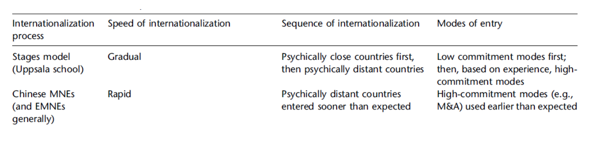
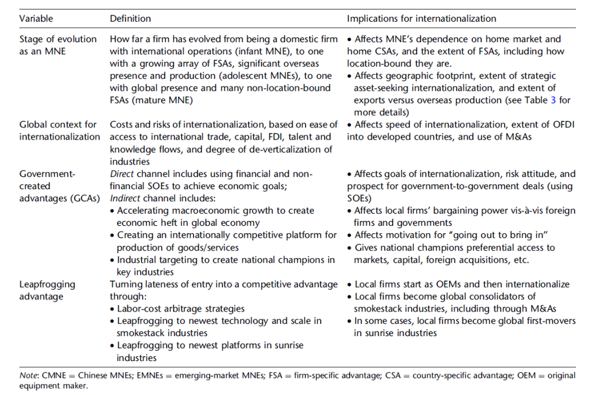

## Chinese Multinationals going global

we have implicitly always assumed that the FDI flows go from the developed to the developing nations. But the more developing nations grow and close the technology gap to the developed nations, the more we can also expect that the stream goes into the opposite direction.

### The case for emerging-markets MNCs (EMNC)

- In 2018, almost 40% of outward FDI came from emerging economies
- Evidence that EMNCs need specific explanations different from those for MNCs from developed countries
- Most of the research focuses on Chinese or Indian MNCs. In the following, we focus on Chinese MNCs.

**Why EMNC may differ from traditional western-based MNCs?**

#### Chinese specific features of MNCs

- Companies instrumental for achieving political goals, in line with a “realist“ (as opposed to a “liberal” or “constructivist”) worldview
- “Dual circulation“ strategy: Global integration and domestic self-sufficiency in parallel
- Unitary national industrial strategy, announced through five-year plans: Setting targets and providing incentives for home companies, protecting them against foreign firms
- Industrial development by direct funding for industry, government procurement, government R&D support, development of Chinaspecific standards, recruitment of overseas talent, and the legal and extralegal acquisition of foreign technology
- Mixed economy with state-owned giants and (nominally) private firms, many of them being “little giants“ comparable to German Mittelstand firms (“Hidden Champions”), controlled inter alia via within-company communist party cells

### Objectives of Chinese Belt and Road Initiatives

1. Grow GDP: GDP is a key source of power in international politics
2. Increase global presence and prestige: Increase China's soft power that can be used to influence other nations
3. Weaken US strategic threat: Secure China by stabilizing or controlling continental & maritime buffer zone
4. Develop multiple trade routes: Reduce chokepoints for Chinese trade
5. Increase naval reach to protect Chinese shipments: Counter the risk of harassment or blockage by opposing powers
6. Divide potential opposing blocs (ASEAN, EU): Maintain China's weight in world politics by preventing opposing coalitions
7. Build an alternative world institutional order: US-led order is perceived as biased against China

### Are Chinese Firms Multinational?

1. Not really global: very few firms possess global production, marketing, distribution, R&D, or HR
2. Fundamental weakness is few multilingual and multicultural managers: Chinesefirms require 75,000 global managers between 2013 and 2020.
3. National corporate culture and business practices: interpersonal over institutional relationships, short-term profit oriented, state-owned
4. Poor global brand presence, mostly unknown
5. Going global by mergers and acquisitions: quick means of acquiring technology, sales network, and established brand names. Nevertheless, 90% of 300 M&A between 2008 and 2010 not successful. (However, recall that recently Chinese MNCs preferred greenfield investments.)
6. Pent-up cash and search for investment outside China in saturated domestic markets: maximize profits quickly, rather than produce steady revenue.
7. Extremely hierarchical organizational structures and culture: stress discipline and conformity, creates climate of risk aversion rather than encouraging innovations and initiatives.
8. Chinese firms train workers for precise skill and job: few flexible personnel policies or self-improvement.
9. Difficulties in adapting to foreign legal, regulatory, tax, and political environments: few firms have in-house legal counsel. Western politicians become suspicious of Chinese investments.
10. Reciprocity problem: mismatches of expectations between Chinese and non-Chinese multinationals.

### Explaining Chinese MNCs

